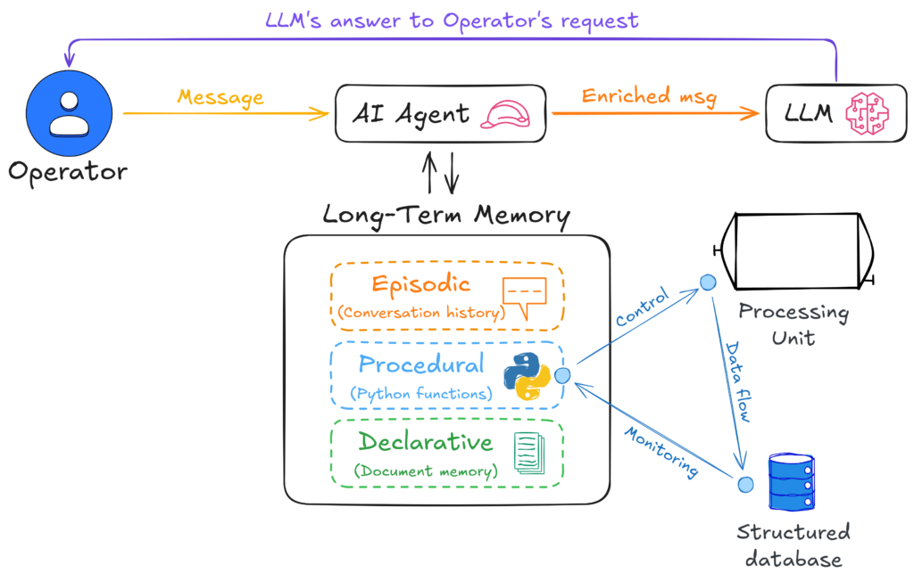
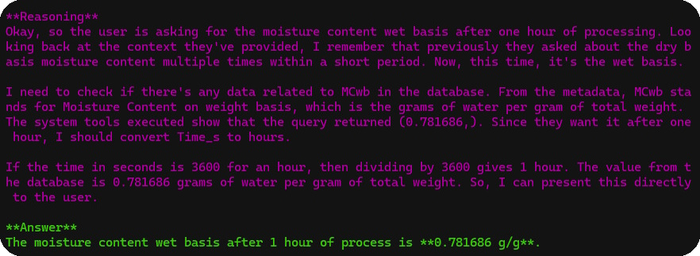

#### What is the Cheshire Cat CLI?

The **Cheshire Cat CLI** (`_cat_chat.py_`) is a command line interface designed to allow real-time interaction with the **Cheshire Cat AI** using Python. This simple tool establishes a WebSocket connection and allows the user to send messages and receive answers from an LLM. It was designed to emphasize the use of **procedural memory**, allowing the user to interact with the AI without relying on a **conversation history**, although this can be optinally enabled. Its design should be ideal for certain industrial and technical applications, where the consistency of AI's answer cannot be affected by previous conversions between user and machine.

The **Cheshire Cat CLI** is very flexible. In fact, it offers a number of customisation options such as connection logging, response timeout, the ability to get the AI's response as a JSON-structured message or as plain text, and to save the output as a JSON file to be used as input for further computation. The latest version also adds the ability to support the AI's reasoning by filtering or not filtering the thinking text (i.e. the message embedded in _<think>\[…\]</think>_ tags).

In summary, the **key features** offered by the **Cheshire Cat CLI** are the following:

- connection via WebSocket with authentication credentials;

- logs to track and debug connection issues;

- decide whether to retain or clear the chat history before each interaction;

- optionally store AI responses in a JSON file for further analysis;

- customize server details, authentication credentials, and timeout settings;

- set a timeout setting to avoid an infinite loop if the AI's answer is missing or takes too long to send from the LLM;

- display AI-generated text only or view the full JSON response;

- enable reasoning to see how the AI obtained its conclusions.

I am constantly thinking about what kind of features would be useful to add to the CLI, but my priority is to keep it as simple and general purpose as possible. A code base that users can fork and modify for their specific use cases. By the way, suggestions and pull requests are welcome.

If you are interested, you can download it [here](https://cheshire-cat-ai.github.io/docs/production/network/clients/).

#### Why Use Cheshire Cat CLI?

The **Cheshire Cat CLI** is not a chatbot interface. It is part of a broader vision: the **Cheshire Cat AI Toolkit for Industry 4.0/5.0**, an open-source project focused on integrating advanced AI conversational agents into industrial applications. In other words, the script was create to allow the integration into a **Smart Monitoring an Control System (SMCS)**. From an ethical point of view, the objective of the project is not to substitute the operators, but to support them in their work with a proactive approach, making it easier and safer (also for the end user). So, more 5.0 oriented than 4.0. Here below the schematic of the idea.

For the intended purpose, a Node-Red node client with similar features, as well as plugins for SQL queries, real-time monitoring, process alerts, decision support, etc. are coming…

#### How to Use Cheshire Cat CLI

To get started, ensure that the **Cheshire Cat AI** server is running and accessible at the specified base URL and port. Then, the basis command is the following:

`python cat_chat.py "your message here" --user_id YOUR_USER_ID --auth_key YOUR_AUTH_KEY [OPTIONS]`

| Argument | Description | Default | Required |
| --- | --- | --- | --- |
| `message` | The message to send to the AI | N/A | Yes |
| `--user_id` | The user ID for authentication | N/A | Yes |
| `` `--auth_key` `` | The authentication key (password) for the server | N/A | Yes |
| `` `--base_url` `` | The server's base URL or IP address | `127.0.0.1` | No |
| `--port` | The port number of the server | `1865` | No |
| `--history` | Maintain chat history (`true`) or clear it before message | `false` | No |
| `--filename` | Save responses to a JSON file | N/A | No |
| `--log` | Enable logging for debugging | Disabled | No |
| `--timeout` | Maximum wait time for AI response (in seconds) | `300` sec | No |
| `--notext` | Show full JSON response instead of only AI text | Disabled | No |
| `--reasoning` | Show AI reasoning in response. | Disabled | No |

**Example of usage in an Industry 4.0/5.0 enabled food dryer**

`python cat_chat.py "tell me the moisture content wet basis after 1 hour of processing" --user_id USER_ID --auth_key AUTH_KEY --reasoning`

#### Further steps?

Apart from the plugins mentioned above, there are some other ideas that must be tested/defined. If you are interested in being part of the project, contact me.

#### Acknowledgements

Thanks to Piero Sevastano for asking me to publish the **Cheshire Cat CLI** on the official **Cheshire Cat AI** documentation website and this blog, and to all the **Cheshire Cat AI** developers for their amazing work.
