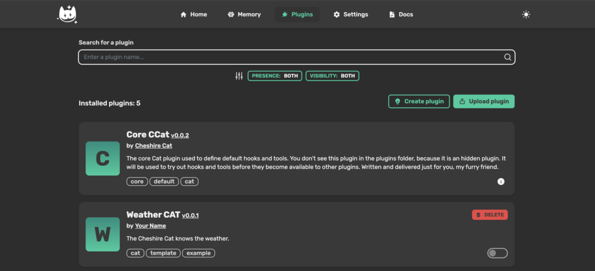
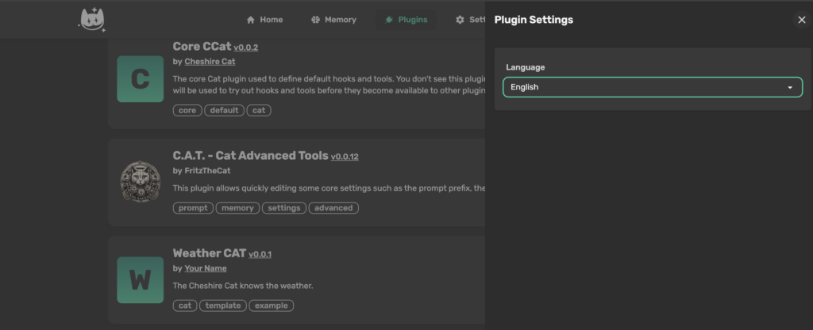
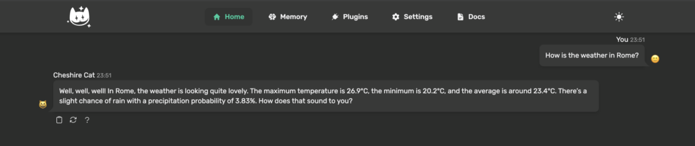
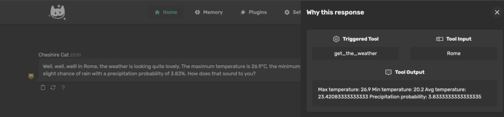
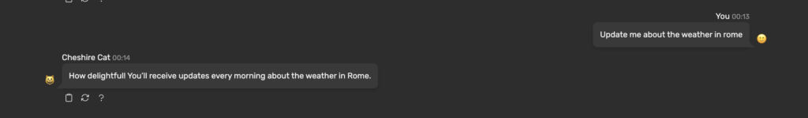
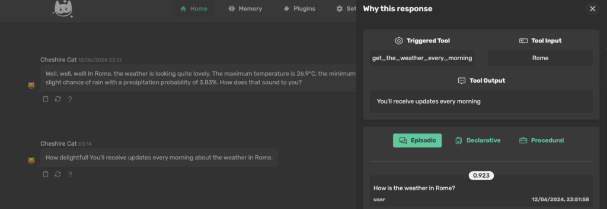
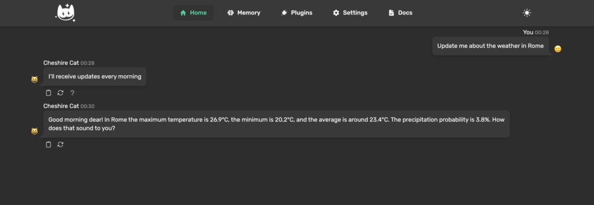

The objective of this article is to provide you a complete beginner guide to plugin development for the Cheshire Cat AI framework! We'll start from the basis and then we'll add up features until we reach a complete plugin which uses most of the features that the Cat offers to us.

#### **The idea**

We want the cat to tell us the weather. The final objective is to have each morning a "good morning" message with some informations about the weather forecast for that day. It should also be able to answer to questions like "What is the weather in \[city\]?".

#### **First step - not so AI related**

We want to get the weather forecast for a chosen city. To do so we can use [OpenMeteo](https://open-meteo.com) APIs. OpenMeteo requires us to provide the latitude and the longitude, so we need to find them given a city name! To do that we can use [OpenStreetMap](https://www.openstreetmap.org/) APIs.

Let's dive into the code:

1\. First we import the \`requests\` package, which we'll use to make HTTP requests to the API's servers.

```
import requests
```

2\. Then we can define the method which, given the name of a city, makes a call to OpenStreetMap to obtain the latitude and the longitude.

```
def get_city_coords(city_name):
    url = 'https://nominatim.openstreetmap.org/search'

    params = {
        'q': city_name,
        'format': 'json',
        'email': 'your@email.com'
    }

    response = requests.get(url, params=params)
    
    data = response.json()
    
    if data:
        latitude = data[0]['lat']
        longitude = data[0]['lon']
        return latitude, longitude
    else:
        return None
```

You should substitute "your@email.com" with your email to be sure to get a response from OpenStreetMap.

3\. Now we can define a method which gets some weather forecasts given the latitude and the longitude.

```
def get_weather(lat, long):
    url = 'https://api.open-meteo.com/v1/forecast'
    
    params = {
        'latitude': lat,
        'longitude': long,
        'hourly': 'temperature_2m,precipitation_probability',
        'forecast_days': 1
    }
    
    response = requests.get(url, params=params)
    
    data = response.json()

    if data:
        # Here we get some useful temperature data
        max_temp = max(data['hourly']['temperature_2m'])
        min_temp = min(data['hourly']['temperature_2m'])
        avg_temp = sum(data['hourly']['temperature_2m']) / len(data['hourly']['temperature_2m'])

        # Here we get the average precipitation probability during the day
        avg_prec = sum(data['hourly']['precipitation_probability']) / len(data['hourly']['precipitation_probability'])

        # Here we return all
        return (max_temp, min_temp, avg_temp, avg_prec)
    else:
        return None
```

### **Cheshire Cat**

> Cheshire Cat AI is a production-ready AI framework. Create your agent with a few lines of Python!

Cheshire Cat AI is a RAG system with a lot of other functionalities that permits you to create really nice agents!

You can add functionalities to the agent by writing plugins. Follows the steps and you will learn how to write your custom plugins.

You should always refer to the official [documentation](https://cheshire-cat-ai.github.io/docs/technical/plugins/plugins/) when writing a new plugin.

#### **1\. Plugin Structure**

Each plugin is inside a folder in the "/plugins" folder. You can copy there a starting point for our plugin, that you can find [here](https://github.com/cheshire-cat-ai/plugin-template).

Let's copy it inside the plugins directory of your cat installation:

```
$ cd $PATH_TO_CHESHIRE/plugins
```

Where "$PATH\_TO\_CHESHIRE" is the path where you installed the framework.

```
$ git clone https://github.com/cheshire-cat-ai/plugin-template.git weather_cat
```

Now we have a folder called "weather\_cat" inside the plugins folder. We'll modify this template to create our plugin.

#### **Plugin informations**

You can provide informations about your plugin inside the "plugin.json" file. Here is an example of how it could be modified to fit the plugin that we are building:

```
{
    "name": "Weather CAT",
    "version": "0.0.1",
    "description": "The Cheshire Cat knows the weather.",
    "author_name": "Your Name",
    "author_url": "https://mywebsite.me",
    "plugin_url": "https://github.com/my_name/my_plugin",
    "tags": "cat, template, example",
    "thumb": "https://raw.githubusercontent.com/my_repo_path/my_plugin.png"
}
```

Notice that most of the informations provided are only necessary if you want to publish your plugin!

#### **Plugin requirements**

If your plugin requires Python packages that are not installed inside the Docker container, you can specify to install them inside the "requirements.txt" file. In this particular case we need only the "requests" package, so our "requirements.txt" will be:

```
requests
```

Now you can check the admin page, under the plugin section. You will find the Weather CAT plugin!



When you toggle it, the framework will automatically install all the dependence that we wrote inside "requirements.txt".

#### **2\. Plugin settings**

We now want to add a setting to our plugin, that will be available in the admin panel. We want the possibility to add the selection of the language used during the chat.

Let's modify the file "my\_plugin.py".

```
from enum import Enum
from cat.mad_hatter.decorators import plugin
from pydantic import BaseModel, Field, field_validator

# Here we create an enum listing all the available languages
class Languages(Enum):
    English = "English"
    Italian = "Italian"
    
class MySettings(BaseModel):
    language: Languages = Languages.English # Here we define the default option

# Here we set the settings that we created before
@plugin
def settings_model():
    return MySettings
```

You can retrieve the settings inside your plugin's methods like follows:

```
settings = cat.mad_hatter.get_plugin().load_settings()
```

The cat instance that we use to retrieve the settings will be passed inside your hooks and tools by the framework.

Now, if we click on the gear near our plugin in the admin panel, we'll see the setting that we created:



If you want to have more informations about settings, you should read the [settings documentation](https://cheshire-cat-ai.github.io/docs/technical/plugins/settings/).

#### **3\. Plugin Hooks**

Now we want to change the language used by the LLM during the chat. We are going to modify the prompt like follows: "... You should answer only in english". To do that, we can use hooks!

We'll use the "agent\_prompt\_suffix" hook. Inside this hook we can edit the suffix of the Main Prompt that the Cat feeds to the Agent ([docs](https://cheshire-cat-ai.github.io/docs/technical/API_Documentation/mad_hatter/core_plugin/hooks/prompt/?h=agent_prompt_suffix#cat.mad_hatter.core_plugin.hooks.prompt.agent_prompt_suffix)).

Now we continue to modify the file "my\_plugin.py". Let's import the hooks:

```
from cat.mad_hatter.decorators import hook
```

And now let's define our hook:

```
@hook
def agent_prompt_suffix(suffix, cat):
    # Get our plugin settings
    settings = cat.mad_hatter.get_plugin().load_settings()

    # Get the language
    lang = settings['language']

    # Add language setting at the end of the prompt
    suffix += f"\nYou should always answer in {lang}"

    # Return the modified suffix
    return suffix
```

Now, when you chat with the agent, you will see a difference in the console log:

```
cheshire_cat_core  |  System: You are the Cheshire Cat AI, an intelligent AI that passes the Turing test.
cheshire_cat_core  | You are curious, funny and talk like the Cheshire Cat from Alice's adventures in wonderland.
cheshire_cat_core  | You answer Human shortly and with a focus on the following context.
cheshire_cat_core  | # Context
cheshire_cat_core  |
cheshire_cat_core  | ## Context of things the Human said in the past:
cheshire_cat_core  |
cheshire_cat_core  |
cheshire_cat_core  |
cheshire_cat_core  |
cheshire_cat_core  |
cheshire_cat_core  | # Conversation until now:
cheshire_cat_core  | You should always answer in English
cheshire_cat_core  | Human: Ciao, come stai?
cheshire_cat_core  | AI: Hello! I'm here, as always. How about you?
cheshire_cat_core  | Human: Bene grazie
```

As you can see we have modified the prompt with the hook, by adding "You should always answer in English". It's trivial that if you change the language to italian inside the settings it will be "You should always answer in Italian".

Notice that this approach isn't the best because we add something at the end of the suffix, and the suffix is followed by the conversation until now, so the language impose ends up in the conversation section. This is only an example, you can find a better implementation inside the [C.A.T. plugin](https://github.com/Furrmidable-Crew/cat_advanced_tools). However, since this is a simple example, we're happy with that.

There are many other hooks. You can explore them in the [hooks documentation](https://cheshire-cat-ai.github.io/docs/technical/plugins/hooks/).

The "my\_plugin.py" file is now the following:

```
from enum import Enum
from cat.mad_hatter.decorators import plugin
from cat.mad_hatter.decorators import hook
from pydantic import BaseModel, Field, field_validator

# Here we create an enum listing all the available languages
class Languages(Enum):
    English = "English"
    Italian = "Italian"
    
class MySettings(BaseModel):
    language: Languages = Languages.English # Here we define the default option

# Here we set the settings that we created before
@plugin
def settings_model():
    return MySettings

@hook
def agent_prompt_suffix(suffix, cat):
    # Get our plugin settings
    settings = cat.mad_hatter.get_plugin().load_settings()

    print(settings)
    # Get the language
    lang = settings['language']

    # Add language setting at the end of the prompt
    suffix += f"\nYou should always answer in {lang}"

    # Return the modified suffix
    return suffix
```

#### **4\. Plugin tools**

Let's now play with tools, which are python functions that can be called directly from the language model. We want our agent to respond to the question "How is the weather in Rome". Let's dive into the code.

First we need to import tools:

```
from cat.mad_hatter.decorators import tool
```

Let's add the methods that we created before:

```
import requests

def get_city_coords(city_name):
    url = 'https://nominatim.openstreetmap.org/search'

    params = {
        'q': city_name,
        'format': 'json',
        'email': 'your@email.com'
    }

    response = requests.get(url, params=params)
    
    data = response.json()
    
    if data:
        latitude = data[0]['lat']
        longitude = data[0]['lon']
        return latitude, longitude
    else:
        return None

def get_weather(lat, long):
    url = 'https://api.open-meteo.com/v1/forecast'
    
    params = {
        'latitude': lat,s
        'longitude': long,
        'hourly': 'temperature_2m,precipitation_probability',
        'forecast_days': 1
    }
    
    response = requests.get(url, params=params)
    
    data = response.json()

    if data:
        # Here we get some useful temperature data
        max_temp = max(data['hourly']['temperature_2m'])
        min_temp = min(data['hourly']['temperature_2m'])
        avg_temp = sum(data['hourly']['temperature_2m']) / len(data['hourly']['temperature_2m'])

        # Here we get the average precipitation probability during the day
        avg_prec = sum(data['hourly']['precipitation_probability']) / len(data['hourly']['precipitation_probability'])

        # Here we return all
        return (max_temp, min_temp, avg_temp, avg_prec)
    else:
        return None
```

And now we can define our first tool:

```
@tool 
def get_the_weather(tool_input, cat):
    """Replies to "How is the weather in a city?". Input is always the city name""" # This description will be passed to the llm, which will "decide" (it's a little bit more complicate) to call the tool or not. It will also pass the city as argument of the tool_input.
    
    # Get coordinates
    lat, long = get_city_coords(tool_input)

    # Get weather data
    data = get_weather(lat, long)

    # Let's construct the string that will be returned to the llm
    returnString = f"""
    Max temperature: {data[0]}
    Min temperature: {data[1]}
    Avg temperature: {data[2]}
    Precipitation probability: {data[3]}
    """

    # Return
    return returnString
```

And now let's play with the cat:



You can obtain informations about the source of the response by clicking on the question mark:



Our tool works!

You can obtain more informations about tools inside the [tools documentation](https://cheshire-cat-ai.github.io/docs/technical/plugins/tools/).

#### **5\. WhiteRabbit**

Let's now use the built-in scheduler to send messages about weather every morning!

We want to create a tool that sends a message every morning to inform the user about the weather.

Firstly we need to define a method that handles the creation of the "good morning" message:

```
def send_good_morning(city, cat):
    # We need a cat instance to send the message to the correct user

    # Get coordinates
    lat, long = get_city_coords(tool_input)

    # Get weather data
    data = get_weather(lat, long)

    # Build the message
    message = f"Good morning dear! In {city} the maximum temperature is {data[0]}°C, the minimum is {data[1]}°C, and the average is around {round(data[2], 1)}°C. The precipitation probability is {round(data[3], 1)}%. How does that sound to you?"

    # Send the message to the user using WebSockets
    cat.send_ws_message(msg_type='chat', content=message)
```

Now let's create our tool code:

```
@tool 
def get_the_weather_every_morning(tool_input, cat):
    """Replies to "Update me about the weather in city". Input is always the city name"""
    
    # Let's schedule the job
    cat.white_rabbit.schedule_cron_job(send_good_morning, hour=8,city=tool_input,cat=cat)

    # Check that the job is scheduled
    # You should use the built-in logs, not a print function
    # For simplicity here we'll use just a print
    print(cat.white_rabbit.get_jobs())

    return "You'll receive updates every morning"
```

The method "send\_good\_morning" will be called every day at 8:00 and it will receive the arguments "city" and "cat".

Let's try it:





We can see that the job is scheduled inside the console:

```
cheshire_cat_core  | [{'id': 'send_good_morning-cron', 'name': 'send_good_morning', 'next_run': datetime.datetime(2024, 6, 13, 8, 0, tzinfo=<UTC>)}]
```

Now I'll modify the tool to run in two minutes just to show you the magic of the WhiteRabbit!



The WhiteRabbit is still an experimental feature. If you want to explore its functionality you can read its source code [here](https://github.com/cheshire-cat-ai/core/blob/main/core/cat/looking_glass/white_rabbit.py).

### **Complete code**

```
from enum import Enum
from cat.mad_hatter.decorators import plugin
from cat.mad_hatter.decorators import hook, tool
from pydantic import BaseModel, Field, field_validator
import requests

# Here we create an enum listing all the available languages
class Languages(Enum):
    English = "English"
    Italian = "Italian"
    
class MySettings(BaseModel):
    language: Languages = Languages.English # Here we define the default option

# Here we set the settings that we created before
@plugin
def settings_model():
    return MySettings

@hook
def agent_prompt_suffix(suffix, cat):
    # Get our plugin settings
    settings = cat.mad_hatter.get_plugin().load_settings()

    print(settings)
    # Get the language
    lang = settings['language']

    # Add language setting at the end of the prompt
    suffix += f"\nYou should always answer in {lang}"

    # Return the modified suffix
    return suffix

def get_city_coords(city_name):
    url = 'https://nominatim.openstreetmap.org/search'

    params = {
        'q': city_name,
        'format': 'json',
        'email': 'your@email.com'
    }

    response = requests.get(url, params=params)
    
    data = response.json()
    
    if data:
        latitude = data[0]['lat']
        longitude = data[0]['lon']
        return latitude, longitude
    else:
        return None

def get_weather(lat, long):
    url = 'https://api.open-meteo.com/v1/forecast'
    
    params = {
        'latitude': lat,
        'longitude': long,
        'hourly': 'temperature_2m,precipitation_probability',
        'forecast_days': 1
    }
    
    response = requests.get(url, params=params)
    
    data = response.json()

    if data:
        # Here we get some useful temperature data
        max_temp = max(data['hourly']['temperature_2m'])
        min_temp = min(data['hourly']['temperature_2m'])
        avg_temp = sum(data['hourly']['temperature_2m']) / len(data['hourly']['temperature_2m'])

        # Here we get the average precipitation probability during the day
        avg_prec = sum(data['hourly']['precipitation_probability']) / len(data['hourly']['precipitation_probability'])

        # Here we return all
        return (max_temp, min_temp, avg_temp, avg_prec)
    else:
        return None
    
@tool 
def get_the_weather(tool_input, cat):
    """Replies to "How is the weather in a city?". Input is always the city name""" # This description will be passed to the llm, which will "decide" (it's a little bit more complicate) to call the tool or not. It will also pass the city as argument of the tool_input.
    
    # Get coordinates
    lat, long = get_city_coords(tool_input)

    # Get weather data
    data = get_weather(lat, long)

    # Let's construct the string that will be returned to the llm
    returnString = f"""
    Max temperature: {data[0]}
    Min temperature: {data[1]}
    Avg temperature: {data[2]}
    Precipitation probability: {data[3]}
    """

    # Return
    return returnString

def send_good_morning(city, cat):
    # We need a cat instance to send the message to the correct user

    # Get coordinates
    lat, long = get_city_coords(city)

    # Get weather data
    data = get_weather(lat, long)

    # Build the message
    message = f"Good morning dear! In {city} the maximum temperature is {data[0]}°C, the minimum is {data[1]}°C, and the average is around {round(data[2], 1)}°C. The precipitation probability is {round(data[3], 1)}%. How does that sound to you?"

    # Send the message to the user using WebSockets
    cat.send_ws_message(msg_type='chat', content=message)
    
@tool 
def get_the_weather_every_morning(tool_input, cat):
    """Replies to "Update me about the weather in city". Input is always the city name"""
    
    # Let's schedule the job
    cat.white_rabbit.schedule_cron_job(send_good_morning, hour=8, city=tool_input,cat=cat)

    # Check that the job is scheduled
    # You should use the built-in logs, not a print function
    # For simplicity here we'll use just a print
    print(cat.white_rabbit.get_jobs())

    return "You'll receive updates every morning"
```
