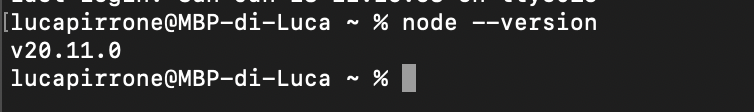
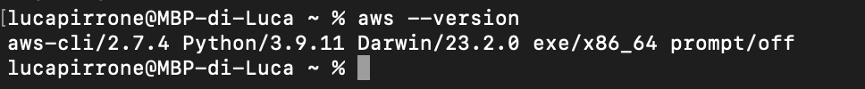
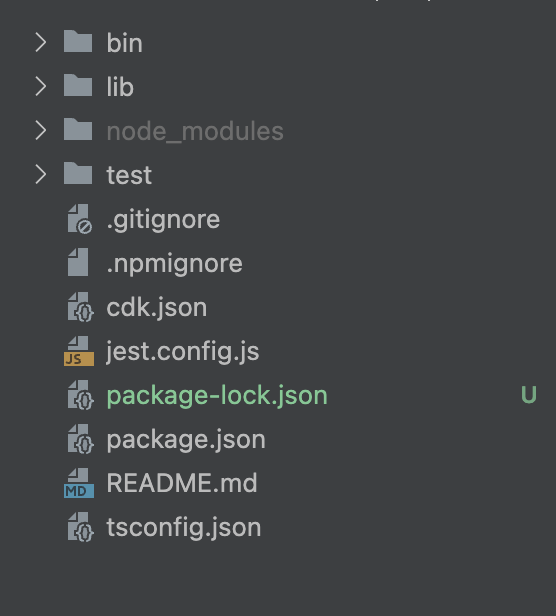
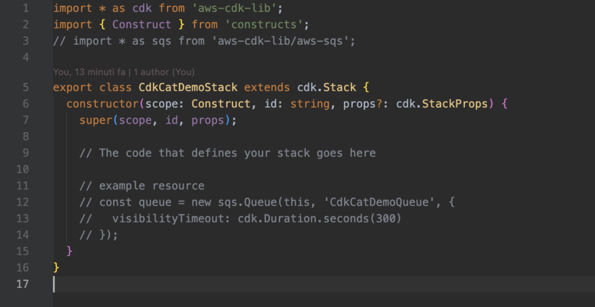
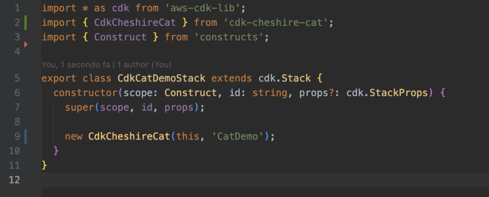
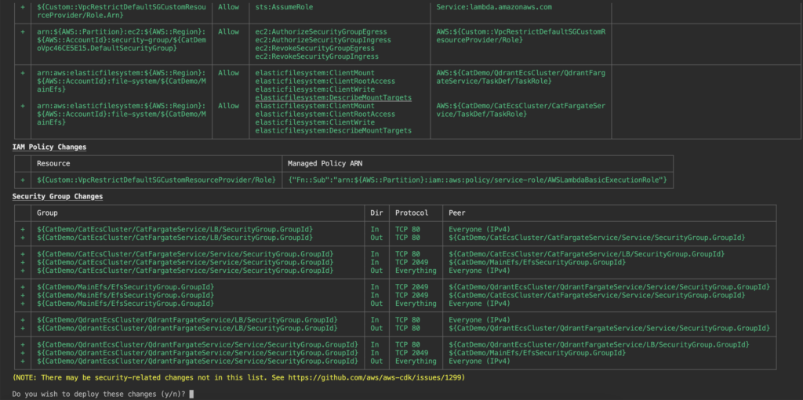
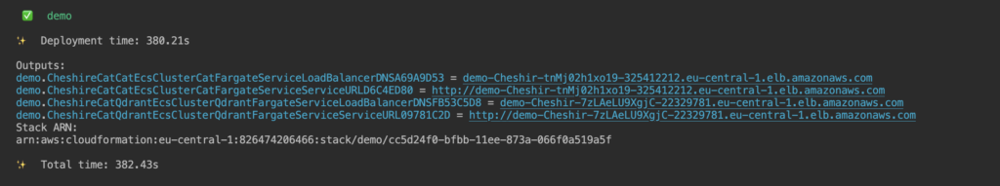
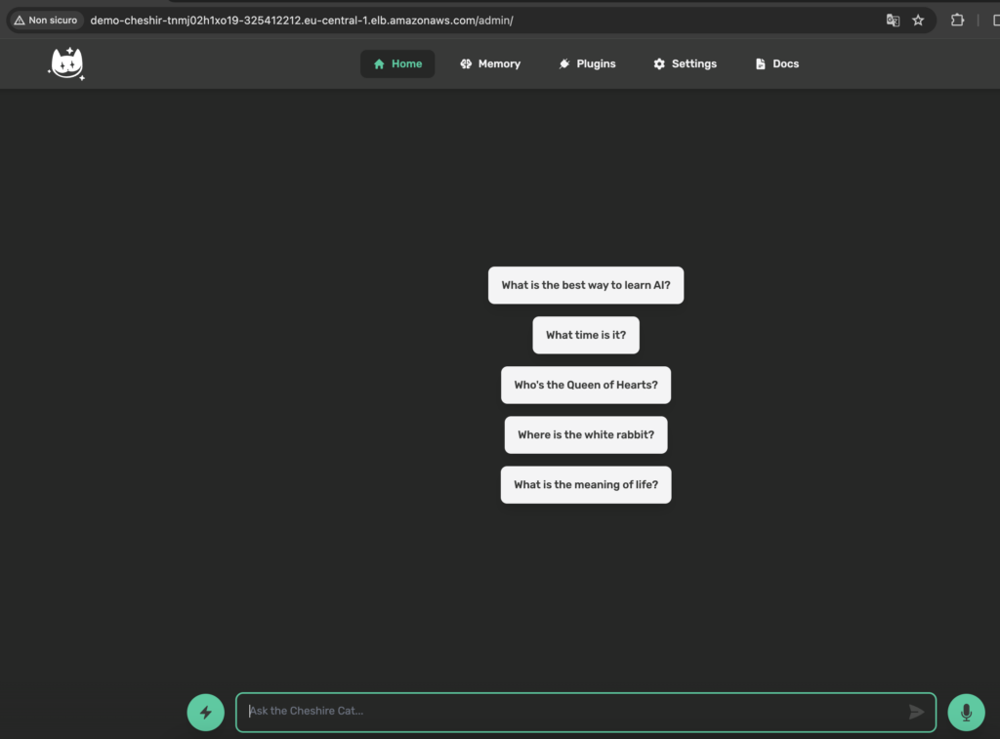
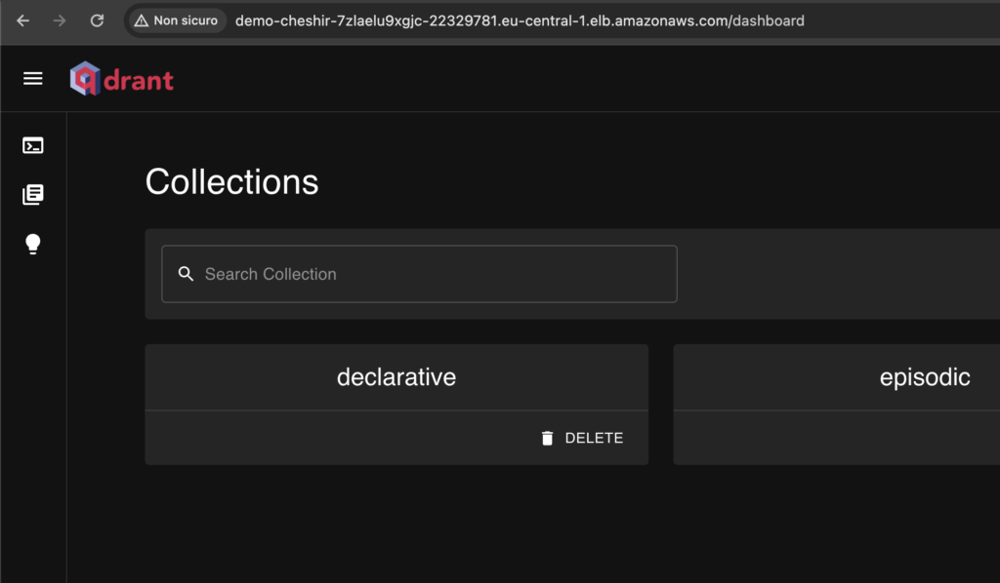
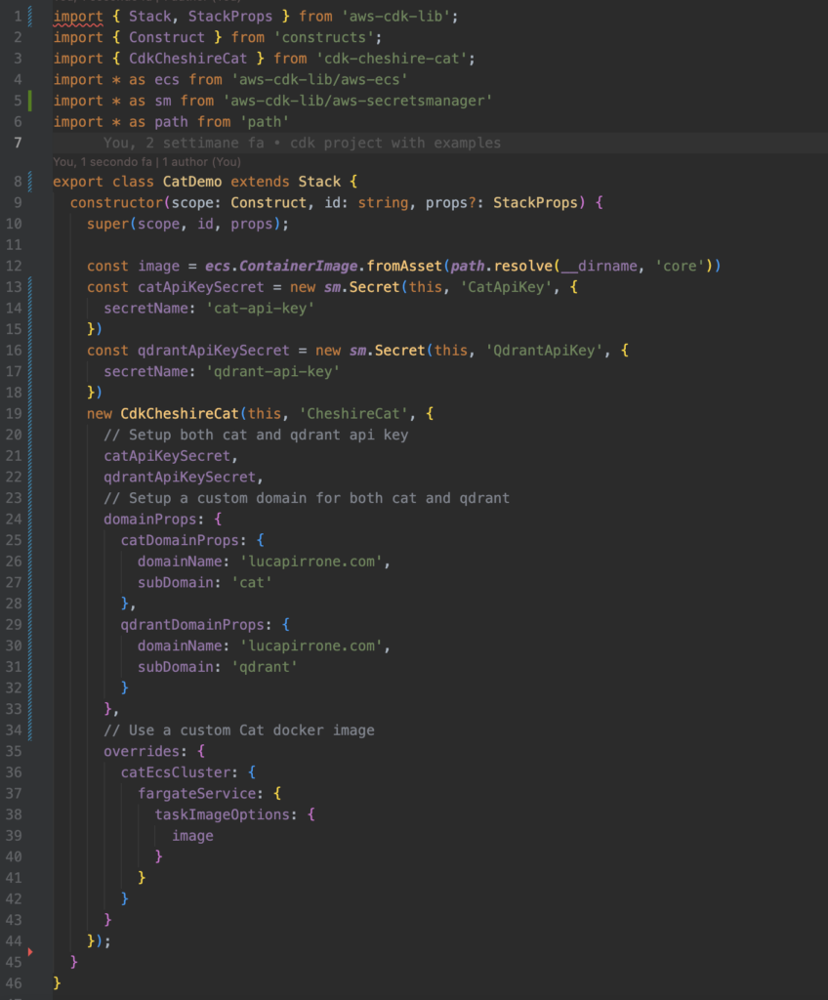

Explore the step-by-step process of deploying Cat on an AWS environment using the AWS CDK framework in this detailed guide.  
From configuring the environment to releasing your own version of the cat on the cloud.

> **CAUTION**
> 
> cdk-cheshire-cat needs cheshire cat core version **\>=** 1.4.8

## Step 1: Environment Setup

To get started with AWS CDK, it's important to first make sure you've got Node.js, the AWS CLI, and the AWS CDK Toolkit installed. Also, you'll need to set up your AWS credentials through the AWS CLI. Here's a step-by-step breakdown:

### Node.js Installation

For AWS CDK, Node.js is a must-have. It's a JavaScript runtime that lets you run JavaScript code on your machine. You can grab Node.js from its [official site](https://nodejs.org/en). Ensure you're getting version 10.x or later. To confirm its installation, just type `node --version` in your terminal.



### Getting AWS CLI Set Up

This is the main tool for interacting with AWS services directly from your terminal. You can download the AWS CLI from the [official AWS website](https://docs.aws.amazon.com/cli/latest/userguide/getting-started-install.html). After installing, you can check the installation by running `aws --version` in the terminal.



### AWS CLI Configuration

With the AWS CLI installed, the next step is to [configure it](https://docs.aws.amazon.com/cli/latest/userguide/getting-started-install.html) with your AWS credentials. Run `aws configure` in the terminal and enter your Access Key ID and Secret Access Key. These are the keys to your AWS account, allowing you to authenticate your requests.

### Installing the AWS CDK Toolkit

This toolkit, also known as the AWS CDK CLI, is a command-line tool for managing AWS CDK apps. Install it globally on your system by running `npm install -g aws-cdk` in the terminal. The global installation (-g) means it'll be available across all your projects. To ensure it's properly installed, type `cdk --version` in the terminal.

After completing these steps, your AWS CDK setup is ready.

## Step 2: Create a new Cat CDK Project

Initiate a new TypeScript CDK project by running the following command inside your project folder (named 'cdk-cat-demo' for this example):

`cdk init app --language typescript`

The output should look like this.



In `lib/cdk-cat-demo.ts` you’ll define your app infrastructure.



## Step 3: Install cdk-cheshire-cat package

The simplest way to implement the cheshire cat in a CDK application is to use the cdk-cheshire-cat package, which provides a ready-to-use layer 3 CDK construct. [Here](https://docs.aws.amazon.com/cdk/v2/guide/core_concepts.html) you can learn more about key concepts that anyone should have when getting started with CDK.

The first step to install the Cat in your CDK app is to installing the package by running the following command:

```
npm install cdk-cheshire-cat
```

Next you need to instantiate the CdkCheshireCat construct within your CDK application stack



## Step 4: Deploy the Cat

To deploy stacks using AWS CDK, specific Amazon S3 buckets and various resources need to be accessible to AWS CloudFormation throughout the deployment process. To set this up, use the command:

`cdk bootstrap`

Finally, we're ready to deploy the stack. Go to the console and type**:**

```
cdk deploy
```



CDK will provide as output an overview of the resources that will be deployed like roles, policies and resources.  
The CdkCheshireCat construct includes the release of these main components:

- **ECS Cluster (Fargate) for Qdrant:** Hosts the Qdrant server, integrated with EFS for data storage and retrieval.

- **ECS Cluster (Fargate) for Cheshire Cat:** Dedicated cluster running the Docker container of the Cheshire Cat application.

- **EFS (Elastic File System):** Centralized storage for persistent data, utilized by both the Qdrant server and the Cheshire Cat application.

After a few minutes the release of the infrastructure is completed and you will see the URLs in the console output to reach both the cat and the qdrant server.







## Conclusion

By following these steps, you can deploy a CheshireCat application with Qdrant Server using AWS CDK. This is an open source framework that enable us to provision AWS resources in a safe, reproducible way through AWS CloudFormation.

## Next Step

In this article you learned how to deploy a simple CheshireCat version, without a custom domain, without making it secure with api key and so on.  
You can extend the initialization properties of the CdkCheshireCat construct to set a custom domain, api keys for both Cat and Qdrant, or to use a custom Cat docker image.



You can read more about how to extend the construct [here](https://www.npmjs.com/package/cdk-cheshire-cat#examples)

## Resources

- [https://aws.amazon.com/it/cdk/](https://aws.amazon.com/it/cdk/)

- [https://docs.aws.amazon.com/cdk/v2/guide/core\_concepts.html](https://docs.aws.amazon.com/cdk/v2/guide/core_concepts.html)
