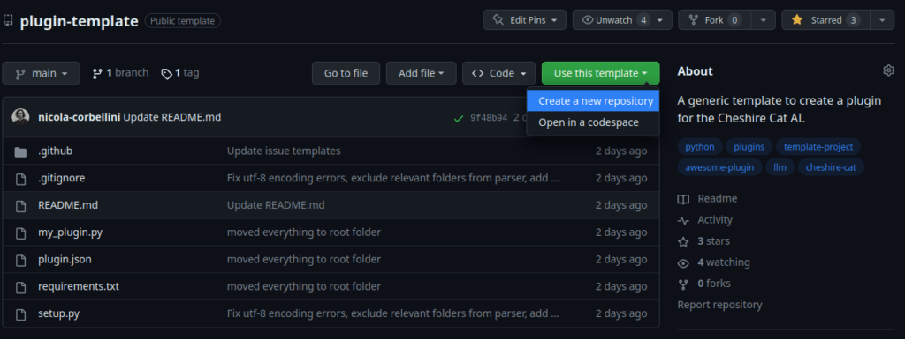
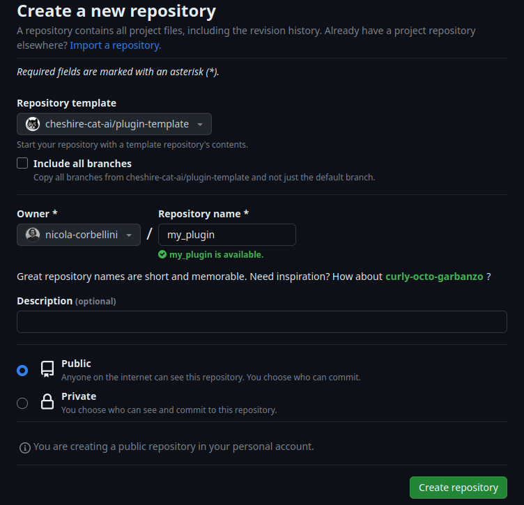

> Use the ready-made repository template to organize and automate the development of an official Cheshire Cat plugin.

You can easily structure a project to develop a plugin for the Cheshire Cat exploiting the [plugin-template](https://github.com/cheshire-cat-ai/plugin-template) repository. A template repository allows creating a new GitHub repository that is an exact copy of the original one. Such repository provides the full set of files you need to develop a plugin. Moreover, it allows automating the plugin release. Specifically, the repository automatically triggers a GitHub action that adds tags and releases a zipped version of your plugin.

* * *

## Structuring your plugin project

1. Navigate to the [plugin-template](https://github.com/cheshire-cat-ai/plugin-template) repository.

3. Click on **Use this plugin** and then **Create a new repository**.



3. Choose the name of your plugin repository and then click on **Create repository.**



4. Now that you set up the remote repository on GitHub, you need to set up the code locally. Hence, clone the repository directly in the Cat's **plugins** folder on your machine.

```
cd your-cheshire-cat-folder/core/cat/plugins
git clone your-repo-url
```

5. Finally, run the `setup.py` script to customize the repository. The script will prompt you to write the name of your plugin and set that name across all the files.

```
python setup.py
```

6. Start developing your plugin following this [tutorial](https://cheshirecat.ai/write-your-first-plugin/)!

* * *

## Plugin repository content

In the template repository, you can find boilerplate files to develop and release a complete Cheshire Cat plugin on GitHub:

- **.github** is the folder with the GitHub action and should not be modified;

- **.gitignore** is where you can add the files that GitHub should ignore;

- **README.md** is the presentation file where you can describe your plugin;

- **my\_plugin.py** is a sample file where you can write the code for your plugin. This is just an example, you can add as much files as you need;

- **plugin.json** is the file with the metadata information about your plugin. **N.B.:** here you should always remember to set the `version` of your plugin as this is needed to trigger a new release;

- **requirements.txt** is the file where you can write your plugin dependencies that will be installed after re-building the docker container;

- **setup.py** is the file for the initial setup to be run before starting developing the plugin. This file replaces all the occurrences of "my\_plugin" with your actual plugin's name.
