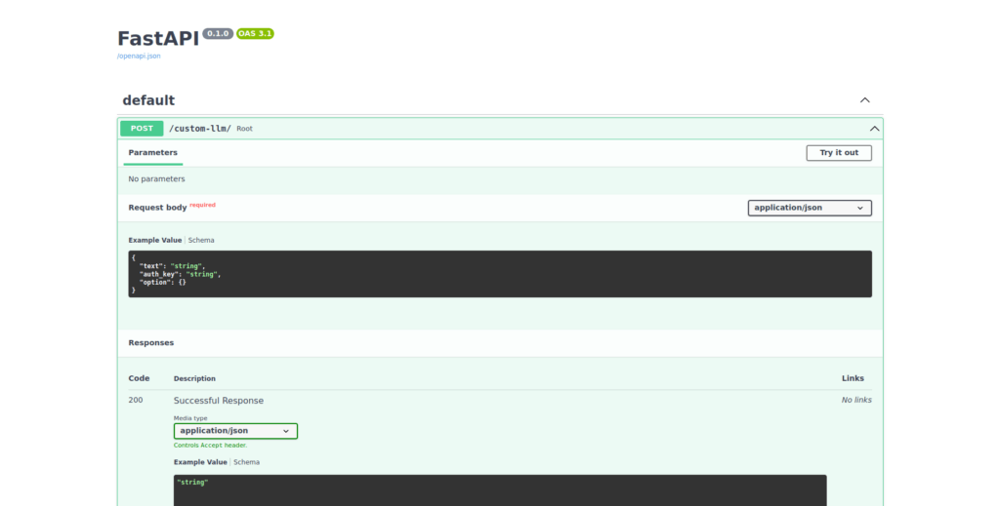
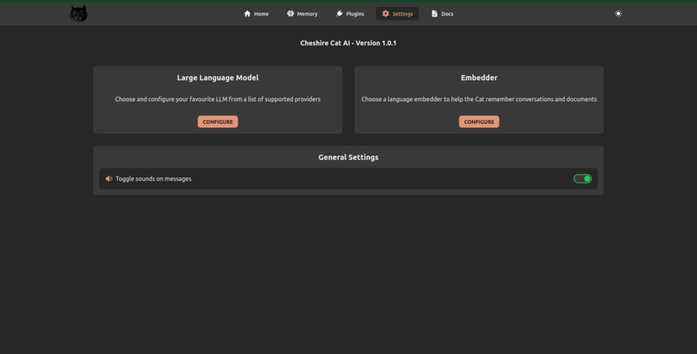
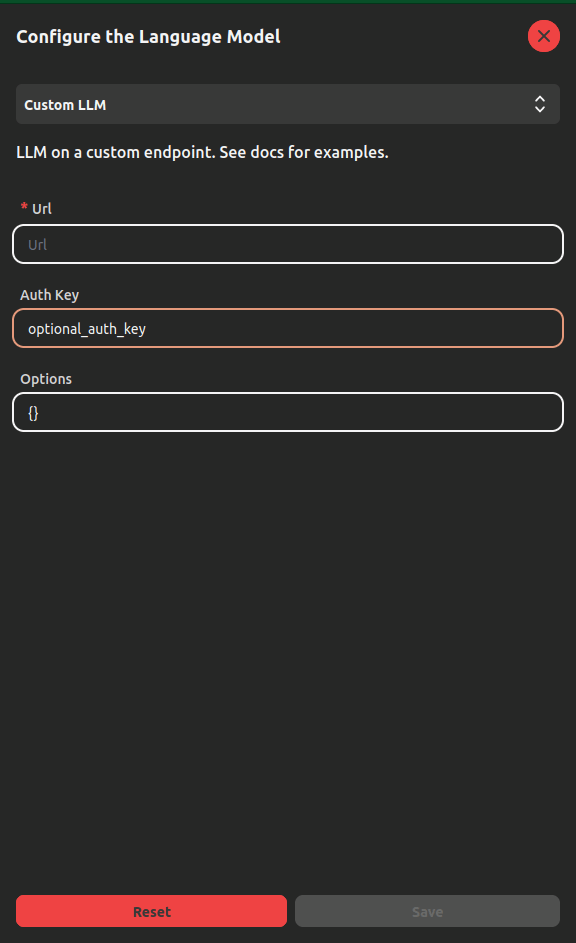

> How to setup the Cheshire Cat to run a custom Large Language Model (LLM).

The Cheshire Cat offers two ways to setup a custom LLM, different from the

1. using the [Text Generation Inference](https://huggingface.co/text-generation-inference) service by Hugging Face;

3. serving the LLM behind a custom REST server.

Option number 1 will be treated in a dedicated tutorial. In this post, we are focusing on the option number 2. The general idea of this solution is to create an endpoint under which you'll perform the inference using you LLM. The Cheshire Cat will make a `POST` request such endpoint, sending a properly formatted request body and expecting a properly formatted JSON answer.

Please, note that the setup may vary according to the model and the inference framework you choose. This article tries to be as agnostic as possible, without making assumptions about the aforementioned choices and providing information about the Cheshire Cat's general setup. Downloading and running the LLM at hand is up to you.

* * *

## Custom LLM REST API

Here is how to setup and run a REST API server in Python to serve the LLM. For the purpose, we'll be using [FastAPI](https://fastapi.tiangolo.com/).

1. First, you need to install a couple of dependencies. Hence, run:

```
pip install fastapi uvicorn
```

2. Now, you can start creating the server. Create a file named `main.py` and import the necessary modules:

```
from fastapi import FastAPI
from pydantic import BaseModel
```

3. Define the class to represent the request body the Cheshire Cat sends and create an instance of the FastAPI app:

```
class RequestBody(BaseModel):
    text: str
    auth_key: str | None = None
    option: dict | None = None
app = FastAPI()
# Instantiate your LLM here, e.g.:
# llm = ...
```

4. Define the endpoint to serve the model. Please, note that the Cheshire Cat is always expecting a dictionary with a `text` key that stores the LLM answer as a response:

```
@app.post("/custom-llm/")
async def root(request_body: RequestBody):
    # The incoming message sent by the Cheshire Cat
    user_message = request_body.text
    # Here you can perform inference using the LLM
    # this part strongly depends on the framework you are using, e.g.
    # answer = llm.predict(user_message)
    return {"text": answer}
```

5. Run the following in your terminal to serve locally the app on `localhost` and port 8000:

```
uvicorn main:app --host 0.0.0.0 --port 8000
```

6. Before moving to the Cat GUI, you can test the app is running correctly in the Swagger, i.e. http:localhost:8000/docs:



## Custom LLM GUI setup

Once the server is running, you have to setup the LLM from the "[Settings](https://cheshire-cat-ai.github.io/docs/technical/basics/admin/settings/)" page, like any other LLM.

1. From your browser, navigate to the "Settings" page to configure a **Large Language Model**



2. Choose **Custom LLM** from the dropdown menu and fill the parameters:



The parameters are: **url**, that is the mandatory address where the REST API is running; **Auth Key**, that is an optional key to authenticate the connection; **Options**, that is an optional parameter where you can pass a dictionary-like text that stores the language model parameters.

3. Click on **Save**.

> Please, note that the Cheshire Cat is running inside a Docker container. Thus, it has it's own network bridge called **docker0**. Once you start the Cat's container, your host machine (i.e. your computer) is assigned an IP address under the Docker network. Therefore, you should set the **url** parameter accordingly.
> 
> Let's make an example: in the code above the **url** parameter should be `http://localhost:8000/custom-llm`. However, you have to change `localhost` with the IP address that Docker assigns to your machine. This depends on your Operating System, thus I invite you to [explore further](https://stackoverflow.com/questions/31324981/how-to-access-host-port-from-docker-container/61424570#61424570).

* * *

As anticipated, the configuration may vary according to your Operating System, the LLM and the inference framework you choose. Thus, this is not an in-depth guide with a practical example. Rather, this tutorial explains the general minimal setup to run a custom LLM with the Cheshire Cat. At this point, you are ready to test your custom LLM with your [plugins](https://cheshirecat.ai/2023/06/17/write-your-first-plugin/)!
