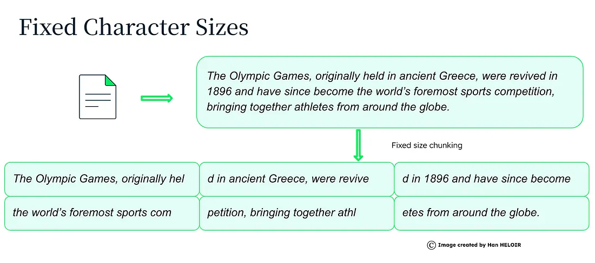
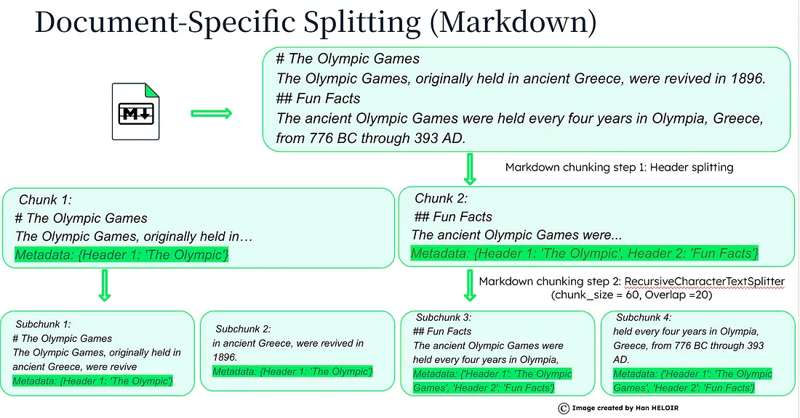
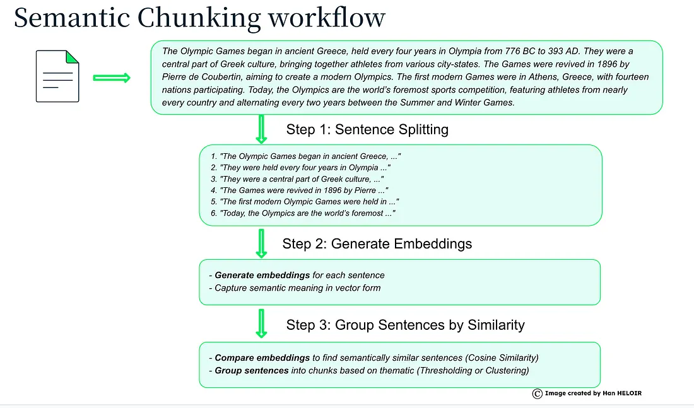
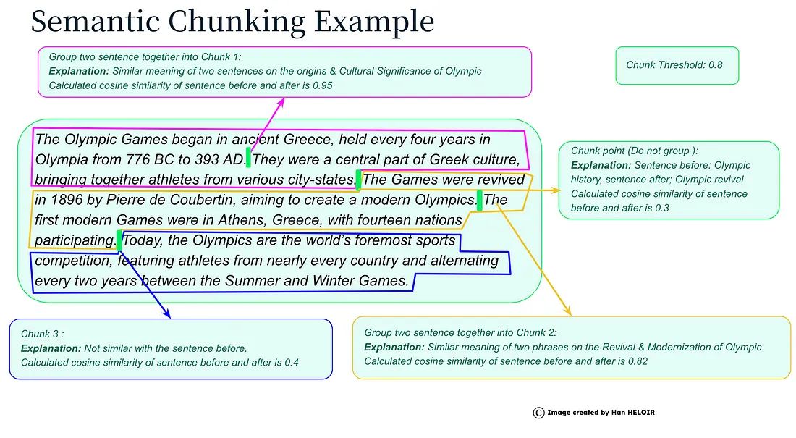
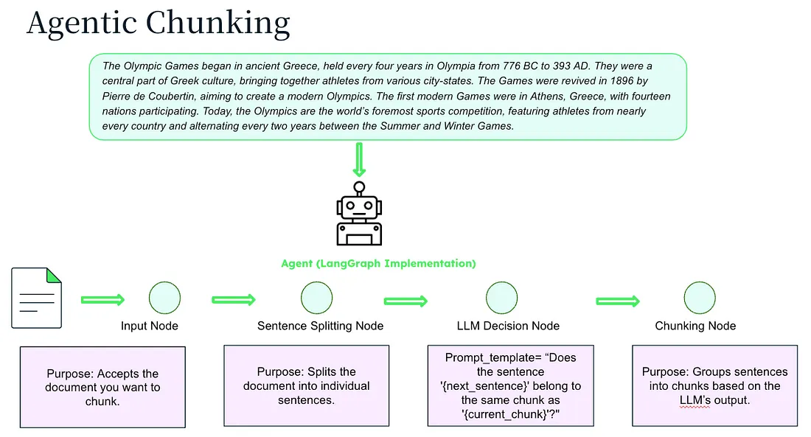

> _This article, collection of notes, was co-written with Cheshire Cat. Memory-loaded items are listed in the resources at the end of the post._

## Introduction

In a digital age overflowing with data, our brains often feel like overloaded hard drives desperately in need of some decluttering.  
Enter chunking - the unsung hero of the retrieval-augmented generation pipeline. Chunking isn't about breaking off tasty morsels (though that does sound appealing); it's about slicing and dicing information into bite-sized pieces that our brains can digest with ease, it is like organizing your sock drawer - it’s all about grouping bits of information into manageable chunks to make your memory life a whole lot easier.  
Get ready to unravel the mysteries of chunking in the retrieval-augmented generation pipeline.  
**Let's dive into the world of organizing information for optimal retrieval and processing efficiency!**

## Why do you need chunking?

Text Chunking is typically step 1 in Vector Database / RAG pipelines.  
In recent years, with the growth of the context length of prompts for LLMs, the recent narrative of artificial intelligence often underestimated the importance of chunking.  
Nothing could be wronger, chunking plays a crucial role in enhancing the performance of the Retrieval-Augmented Generation (RAG) pipeline by improving the efficiency and effectiveness of information retrieval and generation processes.

## The Importance of Chunking

  
This technique plays a crucial role in the retrieval-augmented generation (RAG) pipeline for several reasons:

- **Enhanced Search Relevance**: it breaks down external text into smaller, more manageable chunks, allowing the RAG model to focus on relevant segments during the retrieval phase. This targeted approach improves the accuracy of information retrieval and increases the likelihood of retrieving pertinent content for generating responses.

- **Efficient Data Processing:** By organizing text into structured chunks, the RAG model can process and analyze information more efficiently. Chunking helps optimize computational resources and speeds up the retrieval and generation tasks, leading to quicker response times and improved workflow.

- **Improved Content Generation:** Chunking facilitates the identification of key information within the text, enabling the RAG model to generate more coherent and contextually relevant responses. The segmented nature of chunked data enhances the model’s ability to extract and incorporate essential details into the generated content, resulting in higher-quality outputs.

- **Reduced Noise and Irrelevant Information:** Chunking helps filter out noise and irrelevant data by focusing on specific segments that are more likely to contain valuable insights. By excluding unnecessary information, the RAG model can produce more concise and on-topic responses, enhancing the overall quality of the generated content.

Overall, chunking serves as a foundational technique in the RAG pipeline. It optimizes the information processing pipeline of the RAG model, leading to more accurate retrieval, streamlined data analysis, and improved content generation, ultimately enhancing the overall performance and results of the RAG system.

## Popular Chunking Methods

### Fixed Size Chunking

Dividing text according to a fixed number of characters is the simplest method, which like all methods has pros and cons.

Pros:

- **simplicity** and the fact that all **chunks are the same size**.

Cons:

- **Ignores the structure and meaning of the text** and the clean cut could **break up important information** that should be in the same chunk.

Some variations on the theme may be splitting by word, token or sentence, with or without overlap.



### Recursive Chunking

An improvement of the previous method is recursive chunking.  
In this case, the separator first divides the text, usually punctuation or spaces, and then if the paragraphs are too large, applies chunking by character (word or token).  
It is a good compromise between simplicity and effectiveness in that it manages to account for context while improving the performance of the basic method but without introducing excessive computational cost.

> The base chunker of Cheshire Cat is _`RecursiveCharacterTextSplitter`_, in addition to separators in the text such as carriage return or punctuation separation by tokens it uses the [tiktoken](https://github.com/openai/tiktoken) library developed by OpenAI.

### Document Based Chunking

Document-specific splitting is a way to break down different types of documents (like Markdown, Python code, JSON, or HTML) into smaller pieces. It's done in a way that makes sense for each type of document, so you get the most useful information.  
It is also a widely used methodology for splitting code with dedicated chunkers for several languages.  
Among the pros are that it preserves document structure and adapts to data sources, the cons, on the other hand, are the costs of both computation and maintainability of different splitters.



### Semantic Chunking

A semantic chunker is a tool that divides a text into semantically coherent blocks (chunks).  
Instead of dividing text according to fixed syntactic or length criteria, a semantic chunker uses artificial intelligence algorithms to identify parts of the text that have related meaning.  
Among the pros of this technique there are:

- **Improved text comprehension**: By dividing text into semantically coherent blocks, language models can better understand overall meaning, identify relationships between concepts, and improve the accuracy of generated responses.

- **Relevance of answers**: Due to the division into thematic blocks, the answers generated are more relevant to the user's questions, as the model focuses on the most relevant information.

- **Flexibility**: You can adapt Semantic chunkers to different types of text and different applications, such as semantic search, text summarization, and question answer generation.

Among cons:

- **Implementation complexity**: Identifying semantic chunk boundaries accurately can be complex, especially for ambiguous texts or those with complex structures.

- **Model Dependence**: The effectiveness of a semantic chunker highly depends on the quality of the language model used to identify semantic chunks.

- **The costs**, both economic and processing, that it requires to call an LLM at the chunking step





> Cheshire Cat has a plugin to apply Semantic Splitting, it is called [Semantic Chunking](https://github.com/nickprock/ccat_semantic_chunking).

### Agentic Chunking

This approach harnesses the power of LLMs to mimic what a human would do when reading a text by identifying semantically similar parts and grouping them together without length constraints and without relying on predefined rules or purely statistical methods.  
This method makes the chunks very accurate and adapts to any text structure and format, however, on the other hand the costs rise and the implementation is complex.



### Context Aware Chunking

The context-aware chunking process may vary depending on specific implementations, but in general it involves the following steps:

- **Identification of semantic units**: identification of text units that have a cohesive meaning, such as sentences, paragraphs or sections.

- **Context analysis:** analysis of the context of each unit, considering elements such as punctuation, key words, relationships between sentences, and the overall structure of the document.

- **Chunking**: subdivision of the document of varying sizes, based on the context analysis, trying to balance consistency and granularity.

- **Indexing**: indexing of the chunks to enable rapid search and retrieval.

This methodology can greatly improve the quality of sentence retrieval but the computational cost of the pipeline can be very high because it is almost a mix between document splitting and one (or more than one) of RecursiveCharacterSplitting, Semantic Chunker, and Agentic Chunker.  
In summary, context-aware chunking is a promising technique for improving the performance of RAG systems, but it also presents some technical challenges. The choice to adopt this technique depends on the specific needs of the application and the computational resources available.

## How to write your splitter for Cheshire Cat

To replace Cheshire Cat's chunking strategy with the one you need, you need to build a plugin that will act on the `rabbithole_instantiates_splitter` _hook_.  
The difficulty lies solely in the complexity of your chunking strategy. I'm attaching the code for the Semantic Chunking plugin to demonstrate how easy it is to contribute to Cheshire Cat.

```
from cat.mad_hatter.decorators import hook
from langchain_experimental.text_splitter import SemanticChunker

@hook
def rabbithole_instantiates_splitter(text_splitter, cat):
    settings = cat.mad_hatter.get_plugin().load_settings()
    
    text_splitter = SemanticChunker(
        embeddings=cat.embedder,
        breakpoint_threshold_type=settings["breakpoint_threshold_type"],
        breakpoint_threshold_amount=settings["breakpoint_threshold_amount"],
    )
    return text_splitter
```

## Conclusion

Before closing these notes on chunking and finding out which technique is best let's list its pros and cons.

### Pros and Cons

**_Pros:_**

- **Improved Retrieval:** Chunking helps in organizing information into smaller, more manageable units, making it easier for the system to retrieve relevant data efficiently.

- **Enhanced Comprehension:** By breaking down information into chunks, the RAG model can better understand the context and relationships between different pieces of data.

- **Reduced Cognitive Load:** Chunking reduces the cognitive burden on the system by simplifying complex information, leading to smoother processing and generation of output.

- **Increased Efficiency:** With chunking, the RAG pipeline can process information faster and more accurately, leading to improved performance and productivity.

**_Cons:_**

- **Loss of Context:** Chunking may lead to the loss of some contextual information when breaking down data into smaller chunks, potentially impacting the overall understanding of the content.

- **Over-reliance on Structure:** Depending too heavily on chunking may limit the system’s ability to handle unstructured or more nuanced information that doesn’t neatly fit into predefined chunks.

- **Potential Bias:** The process of chunking itself may introduce biases on the segmentation and categorization of the information, affecting the output of the RAG model.

- **Complexity in Implementation:** Implementing chunking in the RAG pipeline requires careful design and maintenance to ensure that the system effectively leverages this technique without introducing errors or inefficiencies.

## Let's find out what is the best chunking technique

The answer is “there is no perfect technique.”  
When you have to choose a chunking strategy it is always been to keep in mind the data we are going to process.  
It is not certain that just one technique will suffice, perhaps you will need to combine multiple techniques (e.g., spit by character and then by token), it is not certain that the most innovative technique is the best, just look at Chroma's whitepaper in the resources where simple chunking by token or recursive sometimes give better results than LLM-based techniques.  
**_So let the data guide you, take your time to choose the strategy that best suites to your case…and then write a plugin for Cheshire Cat!_**  

## Resources

- [The Art of Chunking: Boosting AI Performance in RAG Architectures](https://towardsdatascience.com/the-art-of-chunking-boosting-ai-performance-in-rag-architectures-acdbdb8bdc2b)

- [Evaluating Chunking Strategies for Retrieval](https://research.trychroma.com/evaluating-chunking)

- [Five Levels of Chunking Strategies in RAG| Notes from Greg’s Video](https://medium.com/@anuragmishra_27746/five-levels-of-chunking-strategies-in-rag-notes-from-gregs-video-7b735895694d)

- [The Best Text Chunking Method?](https://hasanaboulhasan.medium.com/the-best-text-chunking-method-f5faeb243d80)

- [RAG in Production: Chunking Decisions](https://pub.towardsai.net/rag-in-production-chunking-decisions-96a214dbbdc6)

- [Context Aware Chunking for Enhanced Retrieval Augmented Generation](https://medium.com/@glorat/context-aware-chunking-for-enhanced-retrieval-augmented-generation-oct23-9dcd435d9cf1)

> _The cover image is created by [Alessandro Spallina](https://www.linkedin.com/in/alessandro-spallina/).  
> the pictures on the different chunking techniques were created by [Han HELOIR](https://medium.com/@han.heloir)._
