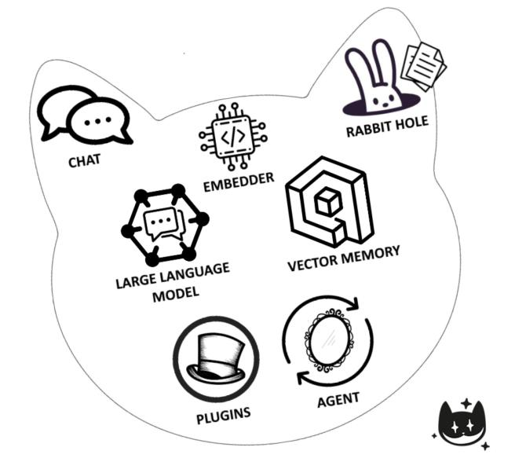
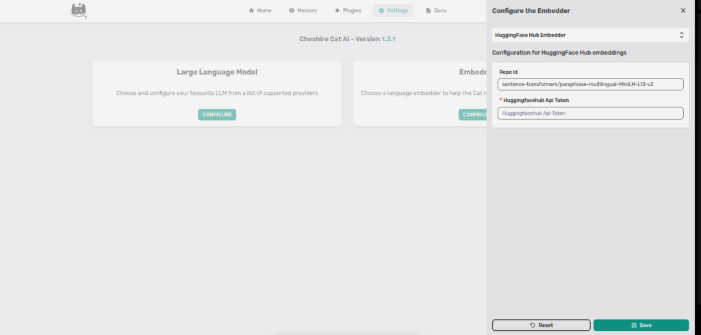
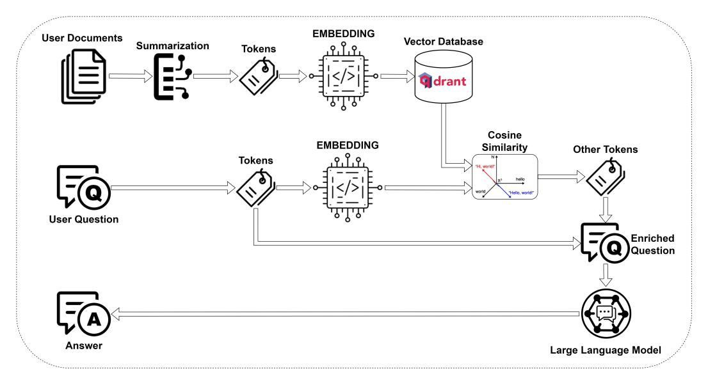
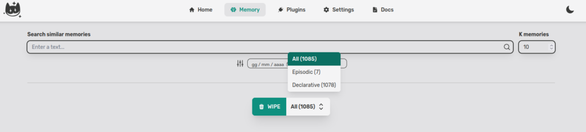
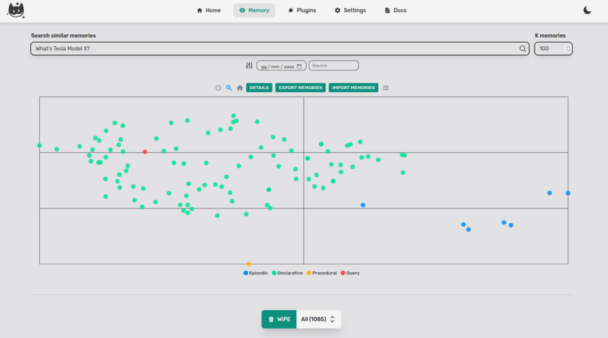
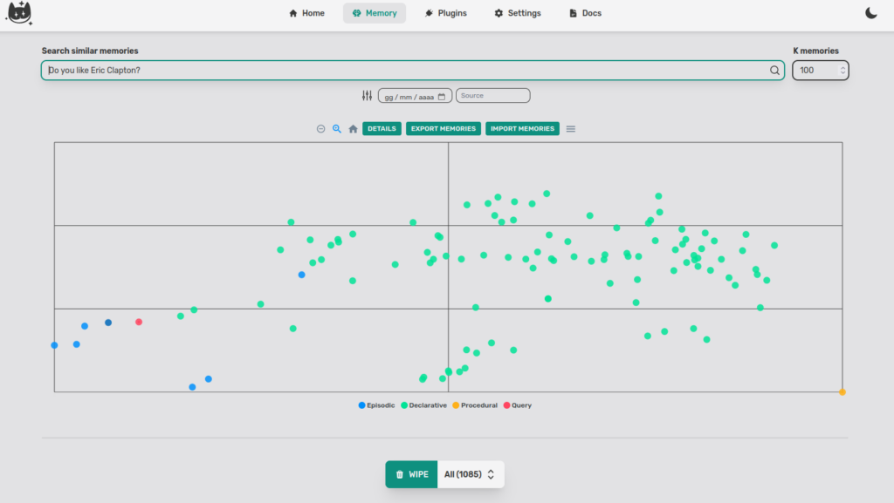
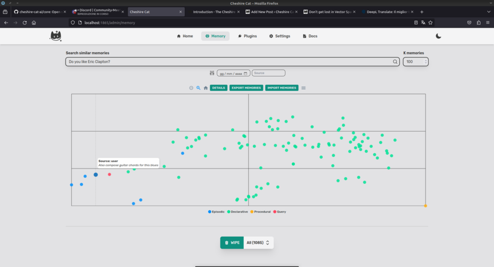
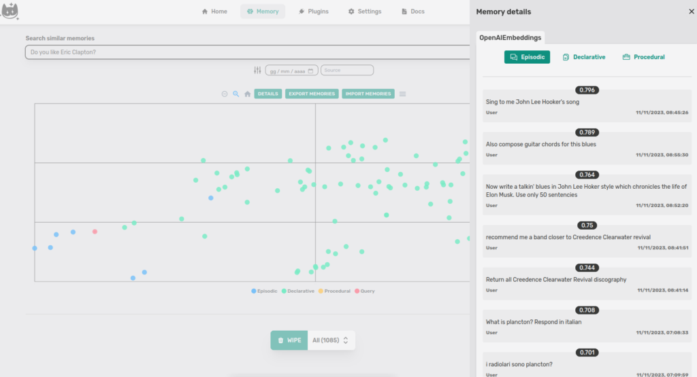
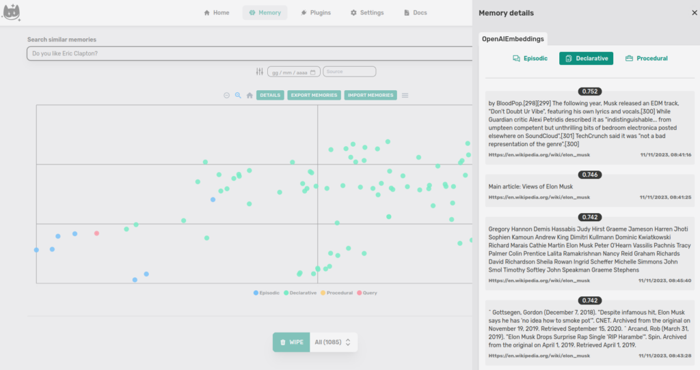
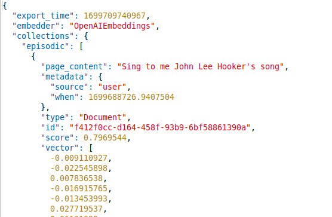

From ["How the Cat works"](https://cheshirecat.ai/how-the-cat-works/), we report a simple image with all the Cheshire-Cat components.



In this post, we focus on the Vector Memory. We look inside it and explain how to import/export and share conversations.

### What's the Vector Memory?

Cheshire-Cat's Memory is based on [Qdrant Database](https://qdrant.tech/), it's a Vector DB that stores objects (in our case text) as N-dimensional vectors using a [sentence embedder](https://arxiv.org/abs/1908.10084).  
For instance, if you use a model like [sentence-transformers/all-MiniLM-L6-v2](https://huggingface.co/sentence-transformers/all-MiniLM-L6-v2) to embed the sentence _"Hello World!"_, its representation is a vector with 386 elements.



The Cat processes all your conversations, documents and tools with the embedder, then stores them in its [memories](https://cheshire-cat-ai.github.io/docs/conceptual/memory/long_term_memory/).  
When we ask the Cat something, it processes our question and uses the [cosine similarity](https://en.wikipedia.org/wiki/Cosine_similarity) to extract the most informative fragments from the memories to construct a response.



For the human mind, to visualize beyond three dimensions is difficult (if not impossible), but dimensionality reduction algorithms help and allow us "compressing" and projecting information onto a two-dimensional space.  
At the moment in the Cheshire-Cat, we use the [TSNE algorithm](https://en.wikipedia.org/wiki/T-distributed_stochastic_neighbor_embedding).

### Take a look into the Cat's memory

First step, select the tab _Memory_ in the Cat's admin (I have already uploaded some documents and conversations).



K memories is the number of returned points. In the plot, in fact, not all documents are displayed, but you can select up to 10000 documents.  
You can easily select other filters such as by Date and by Source.  
The Cat returns also the number of elements in each memory. With the _WIPE_ button you can clean the memories.  
If we don't write anything and click on visualize (the magnifying glass) the Cat returns the points around the embedding of the empty string.


If we write a query like _"What's Tesla Model X?"_, the Cat returns the nearest documents (I stored some wikipedia pages about Elon Musk and I had a conversation about music).



The query (red dot) is far away from the blue dots (music chat) and in the middle of the green dots(Wikipedia information about Musk).  
We can try another query: _"Do you like Eric Clapton?"_



I never mentioned Clapton to the Cat, however, I did ask him to write a blues about Elon Musk. Let's see the closest point (blue dot). The document is _"Also compose guitar chords for this blues"_.



If we want to see the documents we must click on **DETAILS**.





If we look at the Episodic memory documents, we notice that the closest point to the query is the second document in the list.  
This is because the distance we see on **DETAILS** is calculated on the n-dimensional vector with Cosine similarity while the projection in two-dimensional space uses (at the time of writing) Euclidean distance, this can create a small distortion.

#### Export/Import Memories

If you want to export your conversation in a very simple way, just click on **EXPORT MEMORIES** and it downloads the recalled memories in json format.

_**What are recalled memories?**_  
_Recalled memories are the dots that you see in the plot. The Cat doesn't export all the points in Qdrant but only a subset, **YOUR** subset._

The import is the same, you can upload your json simply by clicking on **IMPORT MEMORIES**.



##### Wake up the Dormouse


An experimental feature provided by Cheshire-Cat is to allow memories to be saved to .snapshot.  
With this feature, you don't lose your data when changing embedders.  
To do this just open the .env file and turn on memory collections snapshots when embedder change with

```
SAVE_MEMORY_SNAPSHOTS=true
```
