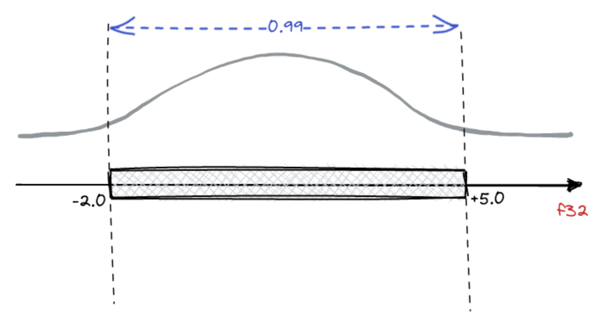

**TL;DR**  
In previous articles, we have seen [how you navigate the vector space, know the memories, export them](https://cheshirecat.ai/dont-get-lost-in-vector-space/), ... and [how these are handled](https://cheshirecat.ai/the-drunken-cat-effect/) by the Cheshire Cat so as not to run into mistakes.  
In this article, we will analyze the Cheshire Cat's vector search flow. Specifically, the document storage, query and retrieve. How can the big cat be so fast and accurate? In the heart of the Cheshire Cat's memory, indeed, Qdrant is the focal point. We list below the features that this open source project offers to show how they make Cheshire Cat's retrieval so wonderfully performant. Ready?

> #### **_"I show you how deep the rabbit hole goes."_**
> 
> The Matrix

## 

### Storage

We've already seen how the Cat creates the embeddings and how [it manages the embedder, thanks to aliases](https://cheshirecat.ai/the-drunken-cat-effect/). Now, let's look at some optimization options.  
The first point is the Indexing Optimizer. If the number of points is less than 10000, the use of any index would be less efficient than a brute force scan. Thus, in the witchcraft, we start indexing when there are at least 20Kb of vectors (taking into account that 1Kb is about a vector of size 256).  
Storage of embeddings can take a lot of memory (especially if they are high size e.g., 1536 ada-002 or 4096 Mistral) and we have a lot of content to load.  
Of course, the larger the embeddings the more precise the representation. Also, the more within the embeddings each position (number) has a large decimal precision, the more accurate the search will be. This becomes disadvantageous when scaling. Especially, if we add that to the precision of the numerical type, the length of the vectors and the quantity of the vectors a plus of memory must be added that the [HNSW algorithm](https://towardsdatascience.com/similarity-search-part-4-hierarchical-navigable-small-world-hnsw-2aad4fe87d37) needs.  
How to solve this problem? Quantization! It improves not only the memory, but also performance.  
There are different types of quantization; we opted for [Scalar Quantization](https://qdrant.tech/documentation/guides/quantization/#scalar-quantization).

Scalar Quantization is a data compression technique that converts floating-point values to integers. [In the case of Qdrant, float32 is converted to int8, so a single number needs 75% less memory](https://qdrant.tech/articles/scalar-quantization/).  
It is not rounding, but a reversible transformation based on the statistical distribution of values in the embeddings. For example, if we know that the distribution of values within vectors stands at 99% two numbers, we can choose to convert the values from float to int. In this way, we'll lose that 1% of accuracy that represents the outliers. Yet, we'll remain in the range of the most likely values. In our case, we choose 95%, that's a good trade-off between accuracy and performance.

Last but not least, **where we store the original and quantized embeddings.**  
For this task, we use an **hybrid mode**. We store the original on disk and the quantized in RAM. This allows to obtain a good balance between speed and memory usage.

### Retrieve

We now know how to compress the embeddings to save space. Yet, how does the Cheshire Cat's vector search retrieve the information without losing accuracy in the results?  
A distinctive feature of the Qdrant architecture is the ability to combine the search for quantized and original vectors in a single query. This enables the best combination of speed, accuracy, and RAM usage.

We compare the quantized embeddings from query and documents. However, remember: we have available also the original vectors!  
If we want to retrieve 10 top-k results by query, we use the quantized vectors. However, we don't retrieve only 10 results. Indeed, we oversample using a score like 1.5 (or 2.0, 3.0 ... it depends on the task) and retrieve 15 quantized embeddings.  
We extract the unquantized counterparts and apply a reordering only on these 15 embeddings. Then, we filter on the first 10 that will be our result.

> **Using these Tips & Tricks the Cheshire Cat's vector search can achieve up to 4x lower memory footprint and even up to 2x performance increase**!

