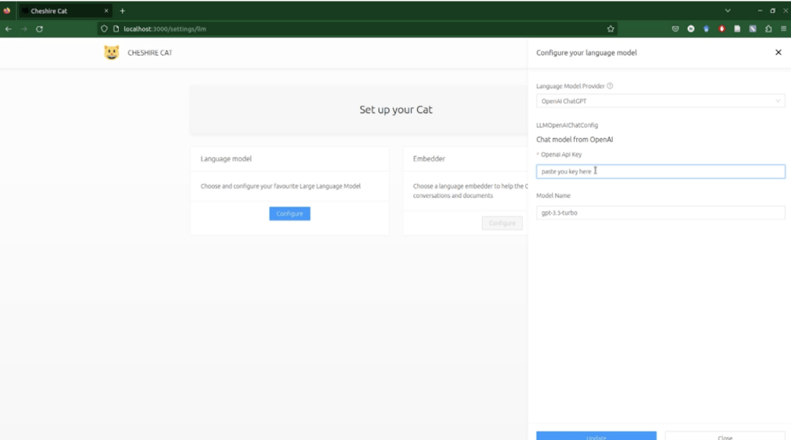

To run the Cheshire Cat, you need to have docker ([instructions](https://docs.docker.com/engine/install/)) and docker-compose ([instructions](https://docs.docker.com/compose/install/)) installed on your system.

- Create and API key on the language model provider website

- Start the app with docker-compose up inside the repository

- Open the app in your browser at localhost:1865/admin

- Configure a LLM in the Settings tab and paste you API key

- Start chatting

You can also interact via REST API and try out the endpoints on localhost:1865/docs

The first time you run the docker-compose up command it will take several minutes as docker images occupy some GBs.

## Quickstart

Here is an example of a quick setup running the gpt3.5-turbo OpenAI [model](https://platform.openai.com/docs/models/gpt-3-5).

Create an API key with + Create new secret key in your OpenAI [personal account](https://platform.openai.com/account/api-keys), then:

Download the code:

```
git clone https://github.com/cheshire-cat-ai/core.git
```

Enter the folder

```
cd core
```

Run docker containers

```
docker compose up
```

When you're done using the Cat, remember to CTRL+c in the terminal and docker-compose down.

### GUI setup



## Update

The project is still a work in progress.  
If you want to update it run the following, one command (line) at a time:

```
cd core
git pull
docker compose build --no-cache
docker rmi -f $(docker images -f "dangling=true" -q)
docker compose up
```
