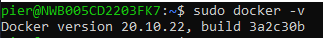
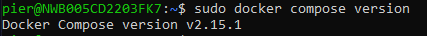

Greetings! In this whimsical guide, we're about to embark on a journey to make the enigmatic Cheshire Cat come to life on your Raspberry Pi. Brace yourself as we go through the magical steps of installing Ubuntu 22.04 LTS and conjuring up Docker and Docker Compose.

Before you dive into the rabbit hole, make sure you've got these essential components:

- Raspberry Pi 4

- MicroSD card (8GB recommended, I used 64GB)

- Computer with a microSD card reader

- Micro-USB power cable (USB-C for the Pi 4)

- Wi-Fi network or an Ethernet cable with an internet connection

- Micro HDMI cable for the Pi 4 and a monitor with an HDMI interface

- USB keyboard and mouse

## Install Ubuntu 22.04 LTS: Down the Rabbit Hole We Go!

Installing the OS on the Raspberry Pi is as simple as a magical incantation, thanks to the Raspberry Pi Imager tool.

Follow these steps to make your Pi worthy of Wonderland:

- **Step 1:** On your PC, download the Raspberry Pi Imager from the official site [Raspberry Pi Imager](https://downloads.raspberrypi.org/imager/). For simplicity, direct links are provided:

- [Ubuntu](https://downloads.raspberrypi.org/imager/imager_latest_amd64.deb)

- [Windows](https://downloads.raspberrypi.org/imager/imager_latest.exe)

- [macOS](https://downloads.raspberrypi.org/imager/imager_latest.dmg)

Alternatively, on Ubuntu, you can run:

```
sudo snap install rpi-imager
```

- **Step 2:** insert the microSD into your PC using the adapter and let the Raspberry Pi Imager work its charm.

- **Step 3:** choose "Ubuntu 22.04 LTS (64-bit)" from the magical menu, select your microSD, and make sure to pick "Raspberry Pi 4."

- **Step 4:** click "Write/Enter" to unleash the Ubuntu image onto the SD card. However, be warned that this process will erase all data. Hence, make sure you've saved your important scrolls.

- **Step 5:** insert the SD card into your Raspberry Pi and connect it to the keyboard, mouse, monitor, and power.

- **Step 6:** power up the Raspberry Pi and follow the on-screen instructions to configure Ubuntu. It's like setting up camp in Wonderland!

- **Step 7:** once the configuration is complete, open a terminal and sprinkle the following commands to update Ubuntu:

```
sudo apt update
sudo apt upgrade
```

## Install Docker and Docker Compose: Docker Wonderland Edition

Now, let's add some Docker magic to our Wonderland. We'll install it via a repository, keeping everything spellbound in the terminal.

```
sudo apt-get install ca-certificates curl gnupg

sudo install -m 0755 -d /etc/apt/keyrings

curl -fsSL https://download.docker.com/linux/raspbian/gpg | sudo gpg --dearmor -o /etc/apt/keyrings/docker.gpg

sudo chmod a+r /etc/apt/keyrings/docker.gpg

echo "deb [arch=$(dpkg --print-architecture) signed-by=/etc/apt/keyrings/docker.gpg] https://download.docker.com/linux/raspbian $(. /etc/os-release && echo "$VERSION_CODENAME") stable" | sudo tee /etc/apt/sources.list.d/docker.list > /dev/null

sudo apt-get update
```

Now install the latest version of Docker:

```
sudo apt-get install docker-ce docker-ce-cli containerd.io docker-buildx-plugin docker-compose-plugin
```

Verify the installation of Docker:

```
sudo docker -v
```

You will see output similar this



Verify the installation of Docker Compose:

```
sudo docker compose version
```

You will see output similar this



And there you have it! You've now set the stage for the Cheshire Cat's grand entrance.

Follow the guide at [Cheshire Cat Installation and Configuration](https://cheshire-cat-ai.github.io/docs/quickstart/installation-configuration/) to bring the cat to life in your Docker-infused Wonderland

> Tip: Consider adding external storage—because even magical cats need some extra space for their tricks! 🎩🐱

## Next Steps

Now that you have your Cat up and running on a Raspberry Pi 4, it's time to start developing [your first plugin](https://cheshirecat.ai/write-your-first-plugin/)!
