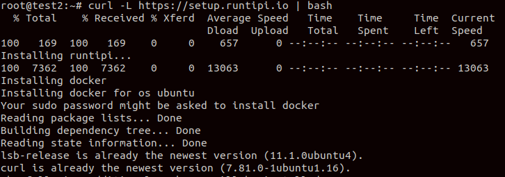
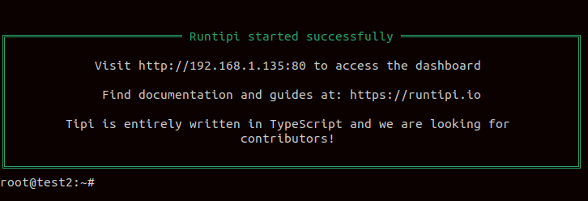
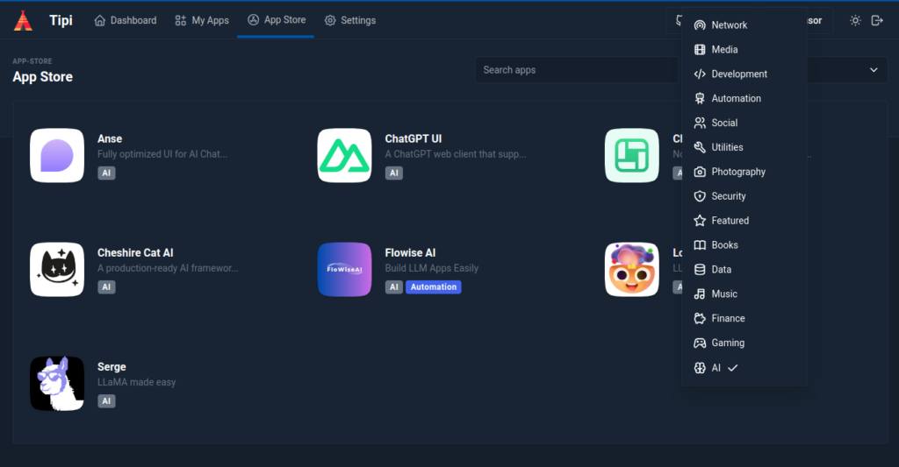
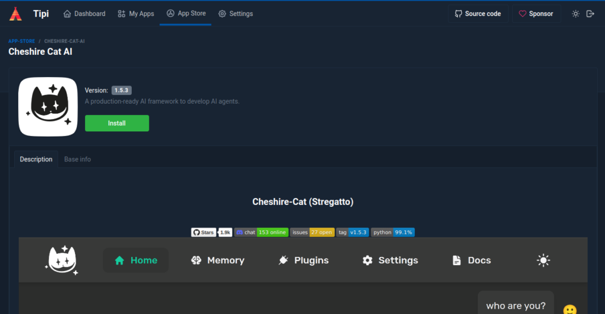
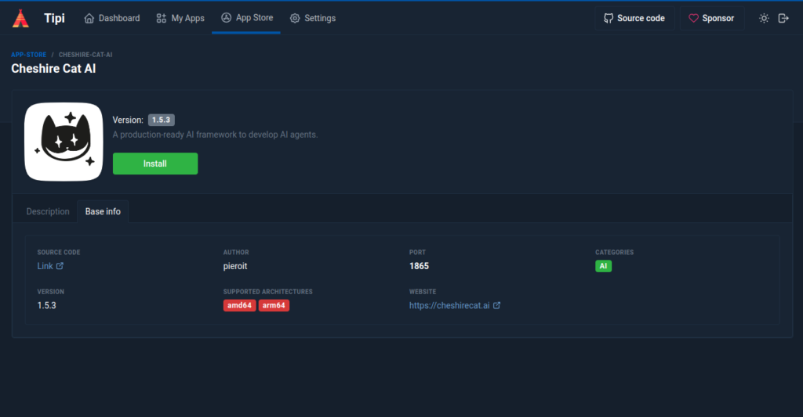
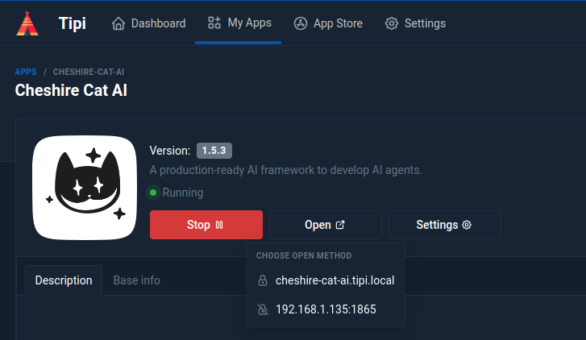

On our blog we have seen how to setup the Cat on _Nginx_ ([https://cheshirecat.ai/how-to-use-cheshire-cat-behind-nginx/](https://cheshirecat.ai/how-to-use-cheshire-cat-behind-nginx/)), in the Cloud with _AWS CDK_ ([https://cheshirecat.ai/cheshire-cat-in-the-cloud-simply-deploy-to-aws-with-cdk/](https://cheshirecat.ai/cheshire-cat-in-the-cloud-simply-deploy-to-aws-with-cdk/)). Today we will learn how to setup easily the Cat on a home server with Tipi.

* * *

_Tipi_ is an open source personal home-server orchestrator. It enables you to manage and run multiple services on a single server. With an _App Store_ with more than 200 apps, it recently got the _Cheshire Cat_ there!

## How to install Tipi

First of all check Tipi's hardware and OS requirements. You can install Tipi's latest version with the following command.

```
curl -L https://setup.runtipi.io | bash
```

If you have some issues with the previous command, you can download directly the script from Github.

```
curl -L https://raw.githubusercontent.com/runtipi/runtipi/master/scripts/install.sh | bash
```

When you launch the command you can see something similar in your terminal.



Once Tipi finishes installation you can see the following output.



You can now visit the specified `url` and access the dashboard.

You need to setup a registration with an email and password (at least 8 characters long). Once in the dashboard, under the `App Store` you can find the Cheshire Cat app.



## Installing the Cat

Once you click on the `Cheshire Cat AI` app, you can see the Cat page in the app store, with basic information about the cat app and a description about it.





You need to click the `Install` button to get the app. The Cat's docker image will be downloaded in the background.

Once the Cat is installed you can simply open the `admin` page, setup your settings for the LLM and embedder and start chatting with the Cat!



You can also stop easily the Cat with the `Stop` red button, but I am sure once you run it you won't stop it anymore!

## Exposing the Cat

Tipi allows you to expose your apps to the internet through a public domain that you own. Automatic _HTTPS_ is provided by _Let's Encrypt_ and Tipi will automatically renew your certificates.

> Exposing your apps will make them accessible from the internet. Make sure you understand the security implications of doing so.
> 
> So be careful in doing that and secure your Cat and eventual other apps.

## Useful links

[runtipi.io](https://runtipi.io)

[https://github.com/runtipi/runtipi-appstore](https://github.com/runtipi/runtipi-appstore)

[https://runtipi.io/docs/getting-started/installation#hardware-requirements](https://runtipi.io/docs/getting-started/installation#hardware-requirements)

[https://runtipi.io/docs/guides/expose-your-apps](https://runtipi.io/docs/guides/expose-your-apps)

[https://cheshire-cat-ai.github.io/docs/administrators/env-variables](https://cheshire-cat-ai.github.io/docs/administrators/env-variables)
