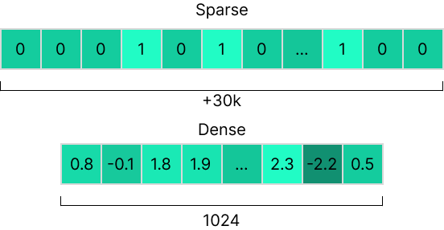
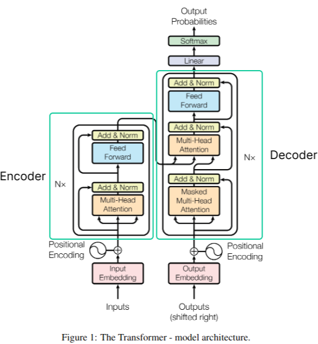
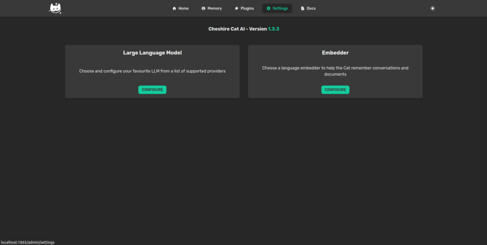
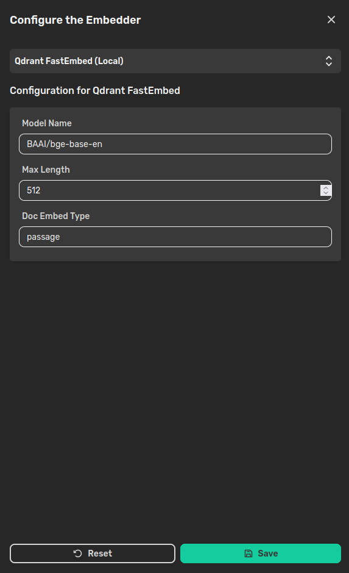
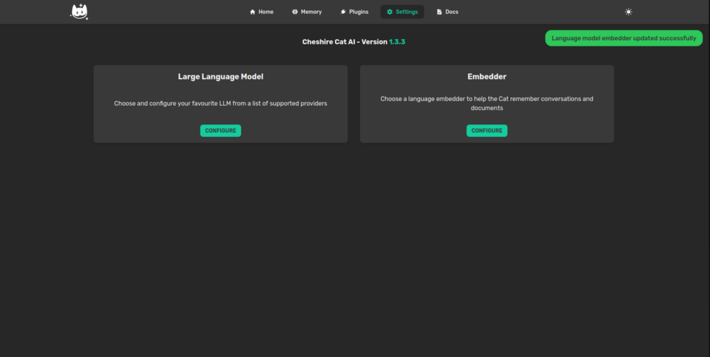
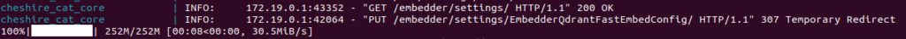

> Easy-to-use setup to run a local embedder model with FastEmbed

Commonly, language models (i.e. chat and completion models) like GPTs, LLaMa, Mistral and so on get most of the attention. However, the so-called embedder models play a crucial role in Retrieval Augmented Generation (RAG) applications, such as the Cheshire Cat. Therefore, this article explains how to setup the Cheshire Cat to run a local embedder model with [FastEmbed](https://github.com/qdrant/fastembed) from Qdrant.

## TL;DR

From version 1.4.0, the Cat will support FastEmbed out-of-the-box. This means that you don't need to setup any external API server and container. Rather, you just need to select it from the available options and type the name of the embedder model you want to use. The Cat will start to download the model locally and that's it. The choice to use FastEmbed rather than other popular embedding inference frameworks is due to it's performing and lightweight nature. Indeed, FastEmbed only needs the ONNX runtime, unlike other popular frameworks that need to install several Gigabytes of dependencies (e.g. Pytorch).

Before diving into the setup, here is a quick high-level explanation of what embedder models are and why they are useful. If you're just interested in the setup, you can skip to the next section.

## What is an Embedder?

In the context of Natural Language Processing, what you may have heard called as "embedder" consists in a specialized deep learning model that encodes a piece of text in a numerical representation. Specifically, this is a fixed-length vector of floating points numbers that, indeed, "embeds" the semantic meaning of the input.

There are manifold long-standing embedding techniques that doesn't ground on deep learning language models (e.g. one-hot encoding, TF-IDF, among others). These techniques produce embeddings known as _sparse_ emmeddings because the resulting vectors have a relatively small number of non-zero elements. Conversely, the techniques grounding on neural networks are known as _dense_ embeddings (you may also encounter _neural_ or _semantic_ embeddings).

While the former performs better in keyword search tasks, the latter performs better in compressing the semantic meaning of text into vectors due to the underlying learning algorithm. More in detail, the current most effective embedders exploit the famous transformers architecture. Specifically, the **encoder** part.

Encoding the text with vectors allows to interpret these vectors as coordinates in a multi-dimensional geometrical space and, hence, to perform geometrical operations, e.g. to assess the similarity of two sentences. Indeed, the Cat exploits text embeddings to [recall relevant vector memories](https://cheshirecat.ai/dont-get-lost-in-vector-space/) from the vector database.

Recently, things have moved very fast and embedding techniques have become more sophisticated than a vanilla transformer encoder architecture. However, this is an introductory overview of the terminology to introduce you what's going on under the Cat's hood and what's the role the embedder plays.

## Setup FastEmbed

As anticipated, setting up a local embedder with FastEmbed is pretty straight forward. All you have to do is to open the "Settings" page in the Cat's admin panel and click on **Configure** under the "Embedder" card.

Hence, choose FastEmbed from the dropdown. For demonstration purpose, we'll use the default model, which is [bge-base-en](https://huggingface.co/BAAI/bge-base-en). You can find a list of the support models [here](https://qdrant.github.io/fastembed/examples/Supported_Models/).

The parameters are the following:

- **Model name**: is the name of the model download.

- **Max length**: is the maximum number of tokens.

- **Doc Embed Type**: the type of document to be embedded. Possible values are "query" and "passage" to discriminate when you are embedding a query text or a document. Here "passage" will be suitable most of the times.

Once you'll click on **Save**, the Cat will start to download the selected model. Thus, please wait to receive a green notification in the admin panel.

If you check in the terminal, you can expect to see something like this, telling you that the Cat set the FastEmbed and downloaded the model:

## Conclusions

Pretty easy stuff, don't you say? Now, you have an embedder model running locally on your machine. If you like experimenting with different models or you're interested in preserving the privacy of your data, you could consider configuring a fully local setup [running a local language model with Ollama](https://cheshirecat.ai/local-models-with-ollama/) and a local embedder with FastEmbed.

Once done, it's time to [develop a plugin](https://cheshirecat.ai/write-your-first-plugin/) and share it with the community!
