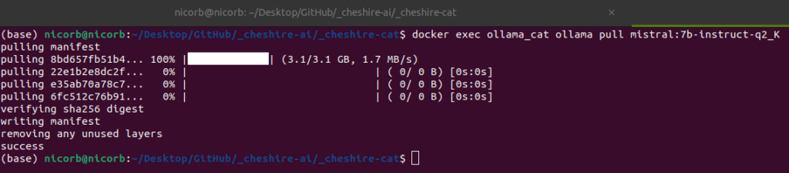
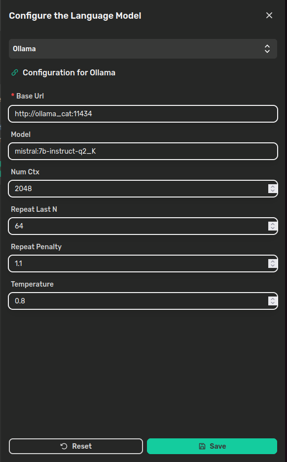

> Easy-to-use setup to extend the Cheshire Cat Docker configuration and run a local model with Ollama.

If you're interested in having the Cheshire Cat running a local Large Language Model (LLM), there are a handful of methods available. These are:

- serving the LLM behind your own [custom API](https://cheshirecat.ai/custom-large-language-model/);

- using the [text-generation-inference](https://huggingface.co/text-generation-inference) service from HuggingFace;

- composing the Cat's containers with the [llama-cpp](https://github.com/abetlen/llama-cpp-python) server;

- composing the Cat's containers with [Ollama](https://ollama.ai/).

In this tutorial, we'll focus on the last one and we'll run a local model with Ollama step by step. For a ready-to-use setup, you can take a look at [this repository](https://github.com/cheshire-cat-ai/local-cat).

## TL;DR

Please, notice that there may be multiple ways to integrate the Cheshire Cat's and Ollama's containers. However, this mostly depends on your need and deepening the Docker configuration is out of this article's scope. Therefore, we'll setup a multi-container application adding the Ollama's container to the Docker's internal network and exposing a port to allow the Cat interacting with the local model.

## Setup Ollama

The Ollama's Docker configuration looks like the following:

```
ollama:
    container_name: ollama_cat
    image: ollama/ollama:latest
    volumes:
      - ./ollama:/root/.ollama
    expose:
      - 11434
# The lines below are needed to allow Docker 
# seeing the GPU. If you have one, uncomment them
#    environment:
#      - gpus=all
#    deploy:
#      resources:
#        reservations:
#          devices:
#            - driver: nvidia
#              count: 1
#              capabilities: [gpu]
```

As anticipated in the comment, if you plan to use your GPU (**Nvidia only!**), you need to uncomment the ending part of the snippet. For this article, we'll experiment using only the CPU.

Therefore, the complete configuration will look like this:

```
version: '3.7'

services:
  cheshire-cat-core:
    image: ghcr.io/cheshire-cat-ai/core:latest
    container_name: cheshire_cat_core
    depends_on:
      - cheshire-cat-vector-memory
      - ollama
    environment:
      - PYTHONUNBUFFERED=1
      - WATCHFILES_FORCE_POLLING=true
      - CORE_HOST=${CORE_HOST:-localhost}
      - CORE_PORT=${CORE_PORT:-1865}
      - QDRANT_HOST=${QDRANT_HOST:-cheshire_cat_vector_memory}
      - QDRANT_PORT=${QDRANT_PORT:-6333}
      - CORE_USE_SECURE_PROTOCOLS=${CORE_USE_SECURE_PROTOCOLS:-}
      - API_KEY=${API_KEY:-}
      - LOG_LEVEL=${LOG_LEVEL:-WARNING}
      - DEBUG=${DEBUG:-true}
      - SAVE_MEMORY_SNAPSHOTS=${SAVE_MEMORY_SNAPSHOTS:-false}
    ports:
      - ${CORE_PORT:-1865}:80
    volumes:
      - ./cat/static:/app/cat/static
      - ./cat/public:/app/cat/public
      - ./cat/plugins:/app/cat/plugins
      - ./cat/metadata.json:/app/metadata.json
    restart: unless-stopped

  cheshire-cat-vector-memory:
    image: qdrant/qdrant:latest
    container_name: cheshire_cat_vector_memory
    expose:
      - 6333
    volumes:
      - ./cat/long_term_memory/vector:/qdrant/storage
    restart: unless-stopped

  ollama:
    container_name: ollama_cat
    image: ollama/ollama:latest
    volumes:
      - ./ollama:/root/.ollama
    expose:
      - 11434
#    environment:
#      - gpus=all
#    deploy:
#      resources:
#        reservations:
#          devices:
#            - driver: nvidia
#              count: 1
#              capabilities: [gpu]
```

You can place the configuration above in a `docker-compose.yaml` file. Thus, run:

```
docker compose up 
# if you have an older version of Docker compose
# docker-compose up 
```

## Setup the Local Model

After starting the containers, there are two steps missing to have your local model running:

1. Download the LLM you prefer;

3. Setup the LLM in the Cat.

### Download the Model

There is a list of available models on the [Ollama website](https://ollama.ai/library). For demonstration purposes, we'll use a 2 Bit quantized version of Mistral 7B, but you can choose the one you prefer.

To download the model, you should run the following in your terminal:

```
docker exec ollama_cat ollama pull mistral:7b-instruct-q2_K
# replace the <model:tag> name with your choice
```

Once done, you can expect to see something like this in the terminal:



### Setup the Model

At this point, you only miss to setup the LLM in the Cat. Thus, open the Admin panel of the Cat and navigate to the "Settings" page; click on `Configure` on the "Language Model" side and setup the Cat like follows:



In the **Base Url** field, there is the address pointing to the Ollama's container, where "ollama\_cat" is the container's name we wrote in the `docker-compose.yaml` and 11434 is the exposed port. In the **Model** field, there is the `<model:tag>` pair you used to download the model.

The other parameters are:

- **Num Ctx**: the context window size to generate the next token;

- **Repeat Last N**: how far back the model should look back in the sentence to prevent repetition;

- **Repeat Penalty**: how strongly to penalize repetitions. Higher values penalize more;

- **Temperature**: how creative the answer should be. The higher the more creative.

## Time to Chat!

That's it! You're done configuring your local model with Ollama and it's time to start [developing a plugin](https://cheshirecat.ai/write-your-first-plugin/).
