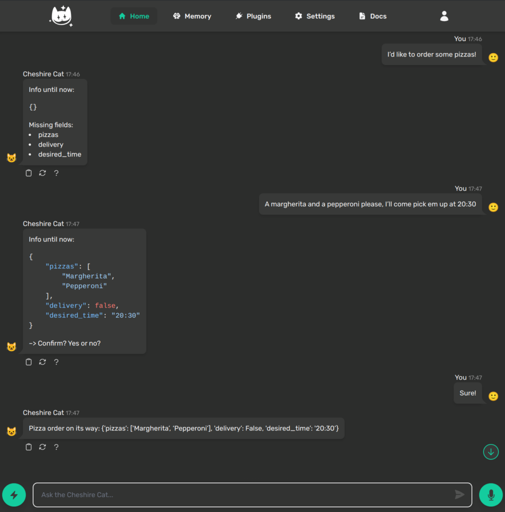
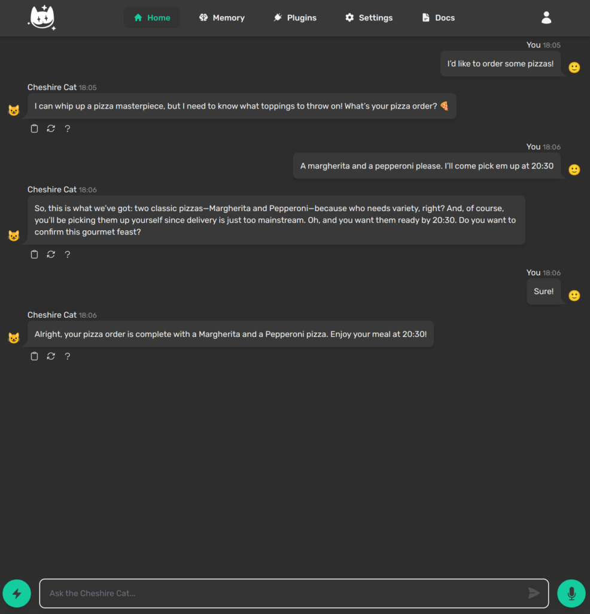
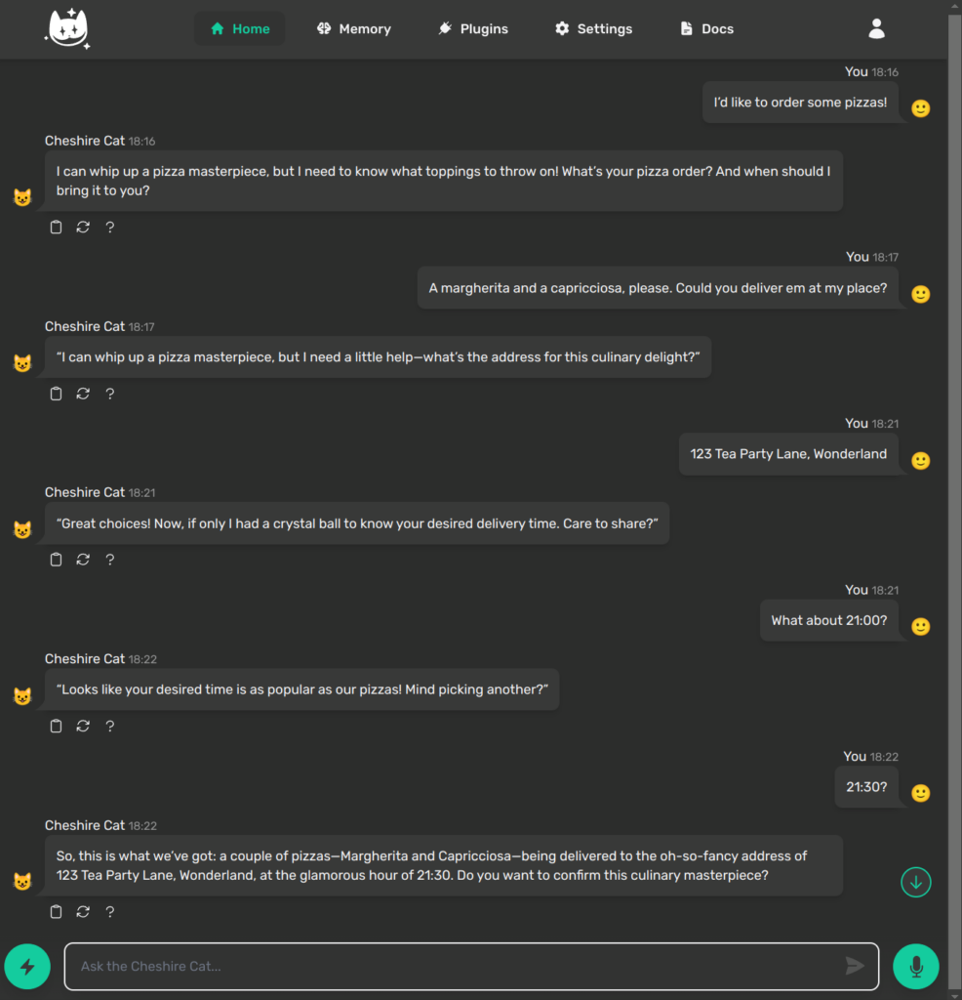

> In this article we explore a complete example of implementation of the conversational forms API, also known as Cat Forms. A very powerful feature of the Cheshire Cat that allows you to extract structured data from an unstructured conversation.

### What Are Conversational Forms?

The conversational forms API is a recent addition to the Cheshire Cat. With just a few lines of code, you can declare a form that gathers information in a conversational way. All you need is a Pydantic model defining your data structure, a few trigger examples and a function to handle the form's completion.

Throughout this guide, we are building a fully functional example of a pizza restaurant order manager. We'll use conversational forms to create an automated bot that collects order while engaging our customers.

### Why a Pizza Restaurant?

The conversational form API is the result of an internal challenge in the Cheshire Cat community, called the Pizza Challenge. The purpose of this challenge was to design a simple and elegant api for collecting structured data through conversational interactions with the Cat.

### Getting Started

To start over you need to create a plugin: create a new folder inside the plugins folder. We will call this `purrfect_pizza_planner`. Inside this new folder create a python script: this will be our playground!

But hey! Guess what? The Cheshire Cat [README](https://github.com/cheshire-cat-ai/core/blob/f14f2c0acebddd3f1f1efb6ba3b161bea45e9e3a/README.md?plain=1#L74) already provides a conversational form example and lucky us this is already about pizza orders. No need to reinvent the wheel: just copy that in your script, we'll dive deep in its details in the following sections. Your code should now look like this:

```
from pydantic import BaseModel
from cat.experimental.form import form, CatForm

class PizzaOrder(BaseModel):
    pizzas: str
    phone: int

@form
class PizzaForm(CatForm):
    description = "Pizza Order"
    model_class = PizzaOrder
    start_examples = [
        "order a pizza!",
        "I want pizza"
    ]
    stop_examples = [
        "stop pizza order",
        "not hungry anymore",
    ]
    ask_confirm = True

    def submit(self, form_data):
        return {
            "output": f"Pizza order on its way: {form_data}"
        }
```

### Breaking Down the Code

Basically, we are declaring a Pydantic model data structure called `PizzaOrder`, here we can define our form in terms of what information should be collected. You specify the required fields, their data types, and any additional descriptions.

Next, we are declaring a class inheriting from the `CatForm` class that should also be annotated with the `@form` decorator.

What about all these attributes? There are different attributes you need to specify when creating a CatForm:

- `description`: a natural language explanation of the form’s purpose. This acts as procedural memory for the Cat, and retrieved whenever the user ask for similar stuff.

- `model_class`: this is a Pydantic model class that defines the structure of data collected during the form execution.

- `start_examples`: lists example user inputs that can trigger the form.

- `stop_examples`: like the previous one, but for those nasty clients that phones you just to ask whether you slice your pizzas or not.

- `ask_confirm`: if set to `True`, this will ask the user for confirmation of his/her order, otherwise, it triggers the order once all the information are gathered.

After defining all the necessary attributes, you can specify the actions to be taken once the form is completed and the user confirms submission. This is where the `submit` method comes into play. You can implement custom code tailored to your specific requirements, which will be executed upon form submission. For instance, you can write here your logic to save the order in an external database.

### Exploring the Inner Workings

Forms are implemented as a [finite-state machine (FSM)](https://en.wikipedia.org/wiki/Finite-state_machine), a structured way to handle the flow of conversational interactions. The FSM ensures that there are distinct stages for every key step of the conversation: collecting information, validating it, and responding to user inputs.

There are four primary states:

- **INCOMPLETE**: the form starts in this state. The Cat engages the user to gather missing information.

- **COMPLETE**: once all required data is provided the bot either asks for confirmation (if `ask_confirm` is set to `True`) or directly submit the form.

- **WAIT\_CONFIRM**: the bot asks the user to confirm the provided details.

- **CLOSED**: the form completes its lifecycle, either submitting the response or exiting the form on user instruction.

### Customizing the Model

Now that we have the basics, let's expand on this foundation to meet a real-world scenario. How can we manage delivery versus pickup, collecting pizza preferences and handle additional customer instructions?

A more detailed model could be like this one:

```
class PizzaOrder(BaseModel):
    pizzas: List[str] = Field(..., description="List of pizzas requested by the customer (e.g., Margherita, Pepperoni)")
    delivery: bool = Field(..., description="True if the customer wants delivery, False for pickup")
    customer_name: str = Field(None, description="Customer's name")
    desired_time: str = Field(..., description="Desired time for delivery or pickup (format: HH:MM)")
    notes: Optional[str] = Field(None, description="Additional notes (e.g., no onions, extra spicy oil)")
```

This model will collect a list of pizzas, whether the order should be delivered or pickup, a customer name for tracking, a desired time and optional additional notes. It may cover some use cases, but what if the user chooses for delivery, we must know where to deliver our pizzas. At the same time, if our customer wants to pick up the order at our place, we shouldn't ask him/her for his/her address.

### Dynamic Models with Model Getter

The `model_getter` is a recent enhancement to the conversational form API, available from version `1.8.0` (if you are using an earlier version, you can simply skip this paragraph). This feature allows you to provide a function that dynamically determines the `model_class` for your form instance. This flexibility unlocks a wide range of use cases where dynamic schema definitions are essential. Here are some practical examples:

- **Loading Extraction Schemas from External Sources**: imagine your marketing team needs to collect different information based on ongoing campaigns. Instead of relying on developers to update the schema, they can use dynamic model getters, similar to how they manage content and forms in traditional CMS.

- **Multi-Tenant Applications**: in scenarios where you serve multiple tenants, each may require a tailored extraction schema. For example, different pizza restaurants might request specific information based on their menus, promotions or operational needs.

- **Conditional Fields**: adjust your extraction schema at runtime based on user input. This ensures you ask for additional information only when necessary, avoiding irrelevant questions. For instance, you might request a delivery address only if the customer chooses delivery over pickup.

To apply the model getter logic to our form we have to declare another Pydantic model with the additional address field. This will inherit from the original `PizzaOrder` so that it can replicate the standard behaviours.

```
class PizzaOrderWithDelivery(PizzaOrder):
    address: str = Field(..., description="Delivery address")

```

Then, inside the `PizzaForm` class we override the default `model_getter` method like this:

```
@form
class PizzaForm(CatForm):
    # ... 

    def model_getter(self):
        if "delivery" in self._model and self._model["delivery"]:
            self.model_class = PizzaOrderWithDelivery
        else:
            self.model_class = PizzaOrder
        return self.model_class

```

### Adding Personality to Your Bot

As you probably have noticed, the form is already working and we can successfully process an order. However, our bot is not that friendly and human-like as we expected.



Let’s face it: a robotic bot that spits out generic responses won’t win your users’ hearts. To truly delight your customers (even those hungry ones!), your bot needs personality.

By default, conversational forms comes with a predefined messaging format that allows developers to debug them while chatting in the admin interface. Lucky us, we can override the default messaging methods to provide a more dynamic and conversational approach to this flow.

Based on the current form state, the Cat will trigger a specific messaging method. Here's how we can override them:

- `message_closed`**:** when the user decides to stop the conversation, your bot can respond with a short, playful goodbye.

- `message_wait_confirm`**:** when waiting for the user to confirm their order, a sarcastic summary can lighten the mood.

- `message_incomplete`**:** if the user leaves some fields blank, your bot gives a humorous nudge to complete the form.

You can either make the bot more deterministic and fetch from a predefined set of answers or you can leverage the LLM to be more adaptable by generating responses in real-time. Here's an example using the LLM:

```
    def message_closed(self):
        prompt = (
            "The customer is not hungry anymore. Respond with a short and bothered answer."
        )
        return {"output": self.cat.llm(prompt)}

    def message_wait_confirm(self):
        prompt = (
            "Summarize the collected details briefly and sarcastically:\n"
            f"{self._generate_base_message()}\n"
            "Say something like, 'So, this is what we’ve got ... Do you want to confirm?'"
        )
        return {"output": f"{self.cat.llm(prompt)}"}

    def message_incomplete(self):
        prompt = (
            f"The form is missing some details:\n{self._generate_base_message()}\n"
            "Based on what’s still needed, craft a sarcastic yet professional nudge. Very short since it is a busy restaurant."
            "For example, if 'address' is missing, say: 'I’m good, but I’m not a mind reader. Where should I deliver this masterpiece?' "
        )
        return {"output": f"{self.cat.llm(prompt)}"}
```

Also the final submit message should be more conversational. Like this:

```
    def submit(self, form_data):
        prompt = (
            f"The pizza order is complete. The details are: {form_data}. "
            "Respond with something like: 'Alright, your pizza is officially on its way.'"
        )
        return {"output": self.cat.llm(prompt)}
```

Here's the result:



Isn't it more engaging?

### Further Improvements

To make your pizza bot more robust, it's essential to implement enhanced validation. While the base model ensures the required data fields are present, adding advanced validation logic can significantly improve the user experience. We simply leverage the [Pydantic](https://docs.pydantic.dev/latest/) library and its powerful API to do that.

Let's implement two practical validators:

- Empty List Check: this ensures the user actually select one or more pizzas before proceeding.

- Desired Time Availability: this verifies that the chosen delivery or pickup time is available by comparing it to an orders table in a database.

We can rewrite our basic `PizzaOrder` to include some field validators from Pydantic like this:

```
class PizzaOrder(BaseModel):
    pizzas: List[str] = Field(..., description="List of pizzas requested by the customer (e.g., Margherita, Pepperoni)")
    delivery: bool = Field(..., description="True if the customer wants delivery, False for pickup")
    customer_name: str = Field(None, description="Customer's name")
    desired_time: str = Field(..., description="Desired time for delivery or pickup (format: HH:MM)")
    notes: Optional[str] = Field(None, description="Additional notes (e.g., no onions, extra spicy oil)")

    @field_validator("pizzas")
    @classmethod
    def check_empty_list(cls, v: str, info: ValidationInfo) -> str:
        if not v:
            raise ValueError("List cannot be empty")
        return v

    @field_validator("desired_time")
    @classmethod
    def check_availability(cls, v: str, info: ValidationInfo) -> str:
        if v in fake_db:
            raise ValueError("The desired time is already taken")
        return v
```

Let's say that our database is currently represented by this dictionary for the sake of simplicity:

```
fake_db = {
    "21:00": {
        "pizzas": ["Margherita", "Pepperoni"],
        "delivery": False,
        "customer_name": "John Doe",
        "desired_time": "21:00",
        "notes": "No onions, extra spicy oil",
    },
    "22:00": {
        "pizzas": ["Margherita", "Pepperoni"],
        "delivery": True,
        "customer_name": "Jane Doe",
        "desired_time": "22:00",
        "notes": "No onions, extra spicy oil",
        "address": "123 Main St, Anytown, USA",
    },
}
```

And here's the result:



Our bot is able to understand the validation errors and provide meaningful responses.

### Conclusion

The Cheshire Cat Conversational Forms API makes it easy to collect structured data in a dynamic, conversational manner. With just a few lines of code you can create bots that feel more human and provide a enjoyable user experience - without the headaches often associated with traditional bot frameworks.

If you want to have a look at the complete source code of this tutorial, just head over to the [Github repository](https://github.com/lucagobbi/purrfect-pizza-planner) and don't forget to leave a star. With your feedback and ideas, we might just take this pizza-loving bot to new heights. Meooow!
