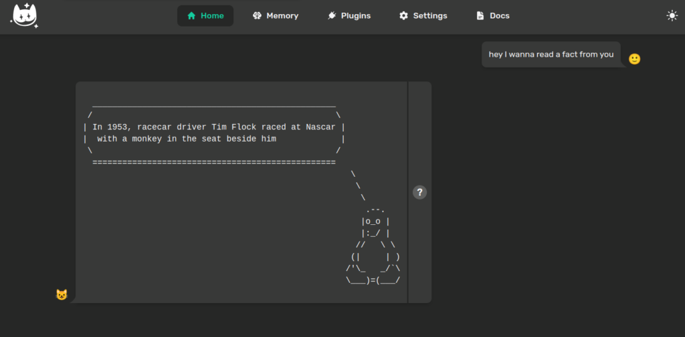

> ### A simple plugin to ask the cat for a fact and enjoy it in ASCII art. Learn new stuff everyday with your favorite cat

```
      |\      _,,,---,,_
ZZZzz /,`.-'`'    -.  ;-;;,_
     |,4- ) )-,_. ,\ (  `'-'
    '---''(_/--'  `-'\_)
```

##### Today you are going to learn how to use the Cat with a funny educational plugin.

Looking to entertain your children but sometimes you lack of imagination due to tiredness? Relax: the Cheshire Cat comes always at hand! With the [catSCII artist](https://github.com/kodaline/the-catSCII-artist) plugin you don't need more than:

- get a _free_ [ninjas](https://https://api-ninjas.com/) _API\_KEY_

- install the catSCII artist plugin from the public store

- add the ninjas key and

enjoy some facts from the world together with your children!

## Zoom in on the plugin

> In the following paragraphs we will focus on how the plugin works and the code behind it.

### How the plugin works



### Hands on the code

First things first, if you have no idea on what plugins are and how to write a simple plugin you might want to give a read at the ["Write your first plugin"](https://cheshirecat.ai/write-your-first-plugin/) and the plugins [documentation](https://cheshire-cat-ai.github.io/docs/technical/plugins/plugins/). Pay attention to the [tools](https://cheshire-cat-ai.github.io/docs/technical/plugins/tools/) documentation.

Checked it? Nice, so let's see the tool that is behind the catSCII artist.

```
@tool(return_direct=True)
def the_catscii_artist(tool_input, cat):
    """
    Useful when you are asked for a random fact, a general fact, a fact. Input is always None.
    """
    limit = 1
    settings = cat.mad_hatter.plugins['the_catscii_artist'].load_settings()
    NINJAS_API_KEY = settings["NINJAS_API_KEY"]
    api_url = 'https://api.api-ninjas.com/v1/facts?limit={}'.format(limit)
    response = requests.get(api_url, headers={'X-Api-Key': NINJAS_API_KEY})
    if response.status_code == requests.codes.ok:
        cat = random.choice(cats)
        res = json.loads(response.text)
        fact = res[0]["fact"]
        output = f"<pre>{cowsay.get_output_string(random.choice(animals), fact)}</pre>"
    else:
        log.error("Error:", response.status_code, response.text)
        output = "No funny facts today, meowy."
    return output
```

**the\_catscii\_artist** tool method has the following docstring

```
    """
    Useful when you are asked for a random fact, a general fact, a fact. Input is always None.
    """
```

The **docstring** is crucial in the tool because it tells the Cat when that specific tool is useful to be executed. In this case the tool is run each time you ask the Cat for some fact. The input is always none, but it can also be whatever value you need the tool to process.

The tool makes the request for a random fact to ninjas with the following line of code

```
requests.get(api_url, headers={'X-Api-Key': NINJAS_API_KEY})
```

Then it returns as output

```
f"<pre>{cowsay.get_output_string(random.choice(animals), fact)}</pre>"
```

if the ninjas api call gets a response, otherwise it returns just

```
"No funny facts today, meowy."
```

#### What's behind the Cheshire Cat ascii art

If you never played with the [cowsay](https://en.wikipedia.org/wiki/Cowsay) library in your life, you should try it right now. It's a funny package that you can freely install on your linux machine and use trough your terminal, but, as it happens in this plugin, also by the Python cowsay package.

In fact, as you can see in this line of code

```
cowsay.get_output_string(random.choice(animals), fact
```

the cowsay library receives the fact incoming from ninjas request, and transforms it in the ascii art, using one of three random animals: cow, fox and [tux](https://en.wikipedia.org/wiki/Tux_\(mascot\)).

I plan to add the support for more animals in the future, especially cats, such as the adorable Cheshire Cat. An improvement will also be the possibility to upload on the Cat your .txt file with the ascii art, making it available and so usable by the catSCII artist.

As you can see the plugin is not complex, still you already can perceive the power that comes in your hands by using the Cheshire Cat.

Yet remember: With great power comes great responsability.

> May the **tool** be with you!

#### Credits

Ascii cat art by Felix Lee.
