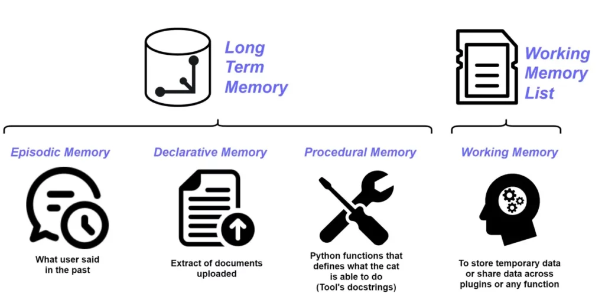
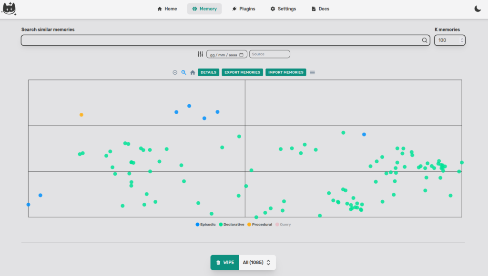
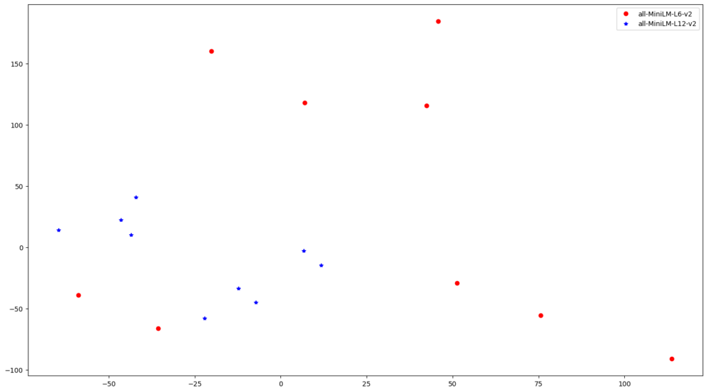
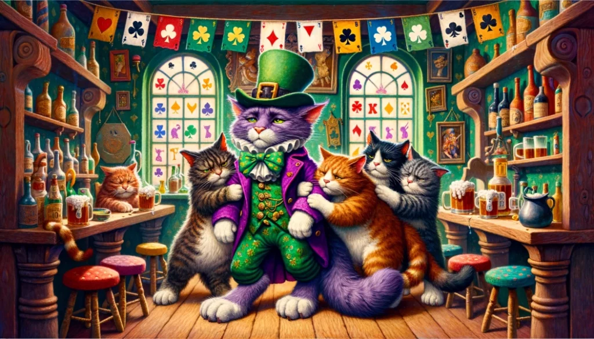
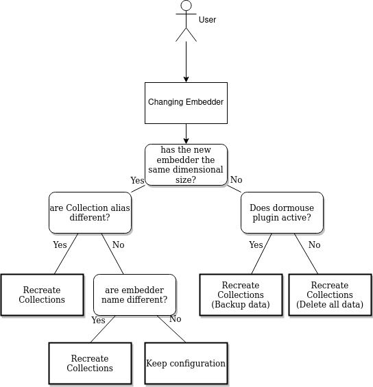

In the [first article about Vector Memory](https://cheshirecat.ai/dont-get-lost-in-vector-space/), we talked about:

- an introduction to [Vector Memory](https://cheshire-cat-ai.github.io/docs/llm-concepts/vector-memory/) and how it works;

- we took a look inside the memory, thanks to the Memory tab in the admin;

- we saw how to save and exchange memories.

Today, we are going to focus on the last point. Specifically, we are going to see why, when we share memories, the starting embedder must be the same on both instances of the Cheshire Cat.

### What's a Vector Space

A **vector space** is a mathematical structure consisting of a set of vectors and operations for adding and scaling them. Vectors are represented as points in a multidimensional space, where each dimension represents a specific attribute or feature. The distance between vectors in this space reflects their semantic similarity, with closer vectors indicating more closely related meanings.

The process of converting language elements into vectors is known as **embedding** ([for an in-depth look](https://cheshirecat.ai/local-embedder-with-fastembed/)). Embeddings assign a unique vector representation to each word or phrase, capturing its meaning and relationships to other language units. These vectors reside in a high-dimensional space, where each dimension represents a semantic or contextual feature of the language element.

Vector spaces play a pivotal role in Natural Language Understanding tasks, enabling LLMs to perform a wide range of functions, in Cheshire Cat we use embeddings and vector space to store information and retrieve it when we need it.

The Vector Space which the Cheshire Cat's memory is based is called [Long Term Memory](https://cheshire-cat-ai.github.io/docs/conceptual/memory/long_term_memory/), and is itself made up of three memories:

- _Episodic_ [](https://cheshire-cat-ai.github.io/docs/conceptual/memory/episodic_memory/)_Memory_, contains an extract of things the user said in the past;

- _Declarative Memory_, contains an extract of documents uploaded to the Cat;

- _Procedural Memory_, contains the set of Python functions that defines what the Cat is able to do.



In the [previous article](https://cheshirecat.ai/dont-get-lost-in-vector-space/), we saw these three memories represented in the same two-dimensional space.



When the Cat creates the three memories, they have the same embedder therefore the same dimensionality and this brings us back to the initial question.

### Why can we only share memories from the same embedder?

In general, it is not possible to use two different embeddings in the same vector space. This is because embeddings represent words or sentences differently. For example, one embedding can represent a word based on its semantic meaning, while another embedding can represent it based on its frequency of use.  
If you try to use two different embeddings in the same vector space, the two embeddings may overlap or collide. This could lead to unexpected and inaccurate results. Moreover, this doesn't allow to share memories between Cat instances.  
Having said this we can think, _"just check the size of the embeddings and the problem is solved"_. This is not the case because **different embedders can create vectors with the same size**.

Let's give an example, we embed five sentences using two sentence-transformers that produce vectors with the same length (384) and the models are from the same family 'all-MiniLM-\*'.

```
import numpy as np
from sentence_transformers import SentenceTransformer
from sklearn.manifold import TSNE
import matplotlib.pyplot as plt

model_1 = SentenceTransformer('all-MiniLM-L6-v2')
model_2 = SentenceTransformer('all-MiniLM-L12-v2')

sentences = ['A man is eating food.',
          'A man is eating a piece of bread.',
          'The girl is carrying a baby.',
          'A man is riding a horse.',
          'A woman is playing violin.',
          'Two men pushed carts through the woods.',
          'A man is riding a white horse on an enclosed ground.',
          'A monkey is playing drums.',
          'Someone in a gorilla costume is playing a set of drums.'
          ]

# Encode all sentences
embeddings_1 = model_1.encode(sentences)
embeddings_2 = model_2.encode(sentences)

# Use TSNE for dimensionality reduction
tsne = TSNE(random_state = 0, n_iter = 1000, metric = 'cosine', perplexity=3)
embeddings2d_1 = tsne.fit_transform(embeddings_1)
embeddings2d_2 = tsne.fit_transform(embeddings_2)

# Do the scatterplot
plt.figure(figsize=(18,10))
plt.plot(embeddings2d_1[:,0], embeddings2d_1[:,1], 'ro')
plt.plot(embeddings2d_2[:,0], embeddings2d_2[:,1], 'b*')
plt.legend(["all-MiniLM-L6-v2", "all-MiniLM-L12-v2"])
plt.show()
```



Despite the sentences being the same and the vectors sharing the size, the points differ because of the initial weights, layers and data on which the models are trained are different.  
In this situation, by inserting a query, the retriever would not give correct results, firstly because we have to choose how to embed the query and secondly because objects coming from different spaces would share the same space.

**The cat would have a big headache!**



### How we solved the drunken cat problem

After checking the dimensionality (it is not possible to store vectors of a size different from that of the [collection](http://it is not possible to store vectors of a size different from that of the collection)) we do a second check, to do this, a [Qdrant](https://qdrant.tech/) feature, [aliases](https://qdrant.tech/), is very useful.  
Aliases are additional names for existing collections, we use them to keep track of the embedder we are using so as not to create conflicts when you change embedder from the admin (or to avoid deleting all the points if you accidentally re-save the same embedder).  
So summarizing the loop:


