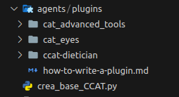
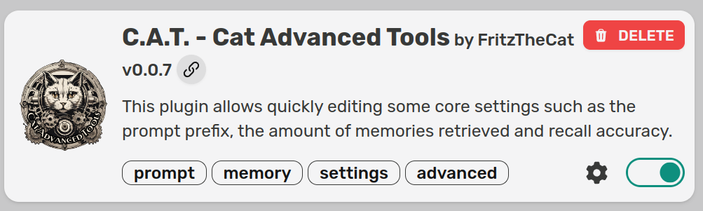

If one Cheshire Cat isn't enough, you're in the right place. Here, you can discover how to multiply your Cheshire Cat, give a different personality to each new Cheshire Cat, and make the various clones communicate with each other.

##### 1\. Basic Cheshire Cat Creation

Firstly, we need to create a folder where we will keep all our clones plus the original; I'll name it 'agents'. Inside, we should download the basic Cheshire Cat. All copies will be based on it, so any plugin or memory you apply to the original will also be reflected in the copies. Additionally, it's advisable to modify the name and/or port in the Docker Compose

To simplify the process, I've created a Python file that allows for the automatic creation of the basic Cheshire Cat.

Before starting, we need to create the correct environment to contain our Cheshire Cats: within the project, there must be a folder, which I will call _"agents"_, where there will be an additional folder named "plugins" (the name is mandatory), containing all the plugins that we want the base agent to have.



Within the plugins, it's mandatory to include the [**C.A.T. - Cat Advanced Tools**](https://github.com/Furrmidable-Crew/cat_advanced_tools) plugin. The latter is essential for managing the [personalities](https://cheshirecat.ai/3-different-ways-to-change-system-prompt-in-the-cat/) of our clones.



Once the folder is created, we can begin by importing the libraries and creating the global variables.

```
import os
import shutil
import subprocess
from git import Repo
import yaml

# Path of the agents folder
agent_folder_path = "agents"

# GitHub repository URL
github_repo_url = "https://github.com/cheshire-cat-ai/core.git"

# Name of the Cheshire Cat
downloaded_folder_name = "base_agent"

# Build the path for the downloaded folder
destination_path = os.path.join(agent_folder_path, downloaded_folder_name)
```

Let's proceed by cloning the GitHub repository and renaming it.

```
if os.path.exists(destination_path):
    # Remove the existing folder
    shutil.rmtree(destination_path)

repo = Repo.clone_from(github_repo_url, destination_path)

# Rename the downloaded folder
os.rename(os.path.join(agent_folder_path, downloaded_folder_name), os.path.join(agent_folder_path, downloaded_folder_name))
```

Now let's replace the Cheshire Cat plugins folder with our own folder.

```
# Replace the plugins folder
shutil.rmtree(os.path.join(agent_folder_path, downloaded_folder_name, "core", "cat", "plugins"))
shutil.copytree(os.path.join(agent_folder_path, "plugins"), os.path.join(agent_folder_path, downloaded_folder_name, "core", "cat", "plugins"))
```

Now let's modify the Docker Compose file. This step is not mandatory but advisable if you already have another Cheshire Cat running or if you want to create some order in the containers.

```
# Build the path for the docker-compose.yml file inside the folder
docker_compose_path = os.path.join(agent_folder_path, downloaded_folder_name, 'docker-compose.yml')

# Load the content of the docker-compose.yml file
with open(docker_compose_path, 'r') as file:
    docker_compose_content = yaml.safe_load(file)

# Modify the content as needed
docker_compose_content['services']['cheshire-cat-core']['container_name'] = f"cheshire_cat_core_base"
# To modify the port (uncomment and modify if necessary)
docker_compose_content['services']['cheshire-cat-core']['environment'][3] = f"CORE_PORT={1866}"
docker_compose_content['services']['cheshire-cat-core']['ports'][0] = f"{1866}:80"

# Overwrite the docker-compose.yml file with the changes
with open(docker_compose_path, 'w') as file:
    yaml.safe_dump(docker_compose_content, file)
```

finally let's do a dokcer build

```
# Build the Docker image
subprocess.run(["docker-compose", "build"], cwd=os.path.join(agent_folder_path, downloaded_folder_name), check=True)

print("Operations completed successfully.")
```

**full code:**

```
import os
import shutil
import subprocess
from git import Repo
import yaml

# Path of the agents folder
agent_folder_path = "agents"

# GitHub repository URL
github_repo_url = "https://github.com/cheshire-cat-ai/core.git"

# Name of the Cheshire Cat
downloaded_folder_name = "base_agent"

# Build the path for the downloaded folder
destination_path = os.path.join(agent_folder_path, downloaded_folder_name)

if os.path.exists(destination_path):
    # Remove the existing folder
    shutil.rmtree(destination_path)

repo = Repo.clone_from(github_repo_url, destination_path)

# Rename the downloaded folder
os.rename(os.path.join(agent_folder_path, downloaded_folder_name), os.path.join(agent_folder_path, downloaded_folder_name))

# Replace the plugins folder
shutil.rmtree(os.path.join(agent_folder_path, downloaded_folder_name, "core", "cat", "plugins"))
shutil.copytree(os.path.join(agent_folder_path, "plugins"), os.path.join(agent_folder_path, downloaded_folder_name, "core", "cat", "plugins"))

# Build the path for the docker-compose.yml file inside the folder
docker_compose_path = os.path.join(agent_folder_path, downloaded_folder_name, 'docker-compose.yml')

# Load the content of the docker-compose.yml file
with open(docker_compose_path, 'r') as file:
    docker_compose_content = yaml.safe_load(file)

# Modify the content as needed
docker_compose_content['services']['cheshire-cat-core']['container_name'] = f"cheshire_cat_core_base"
# To modify the port (uncomment and modify if necessary)
docker_compose_content['services']['cheshire-cat-core']['environment'][3] = f"CORE_PORT={1866}"
docker_compose_content['services']['cheshire-cat-core']['ports'][0] = f"{1866}:80"

# Overwrite the docker-compose.yml file with the changes
with open(docker_compose_path, 'w') as file:
    yaml.safe_dump(docker_compose_content, file)

# Build the Docker image
subprocess.run(["docker-compose", "build"], cwd=os.path.join(agent_folder_path, downloaded_folder_name), check=True)

print("Operations completed successfully.")
```

Once the basic Cheshire Cat is created, we need to start it and activate all the plugins. If necessary, add files. Remember that any files, plugins, or communications you make to this Cheshire Cat will be transferred to its clones. Finally, it's crucial to close the Docker Compose with the command _'docker-compose down'_.

#### 2\. design and creation of clones

###### Designing the Clones

Now that we have our basic Cheshire Cat paired, we need to design and, subsequently, create our clones.

Let's start by designing them: within the project, create another folder, I'll name it **agent\_features**. In this folder, you need to create a JSON file, which I'll name **agents.json**.

```
    "Anna": {
        "port": 1866,
        "settings": {
            "prompt_prefix": "You are a young girl named Anna, 25 years old. You are very intelligent and curious, living in a small countryside town and happy to be there. You work in your parents' store but are studying to go to university.",
            "max_characters": 250,
            "episodic_memory_k": 3,
            "episodic_memory_threshold": 0.7,
            "declarative_memory_k": 3,
            "declarative_memory_threshold": 0.7,
            "procedural_memory_k": 3,
            "procedural_memory_threshold": 0.7,
            "user_name": "User",
            "language": "Italian"
        }
    }
```

The fundamental settings are:

- **The name:** must always be different to identify each individual clone, like an ID.

- **The port:** must be different for each clone to allow the Cheshire Cat to function.

- **The prompt\_prefix:** is the basic description of the inhabitant, providing a valid base personality for each dialogue.

###### Create and Launch the Clones

Now we need to make the design a reality. The first thing to do is create a Python file:

Il codice begins importing the libraries and declaring the global variables.

```
import json
import os
import shutil
import subprocess
import yaml

# Load the content of the agents.json file
with open('agents.json', 'r') as file:
    agent_data = json.load(file)

# Create a dictionary to keep track of our created agents
agents = {}
base_agents_path = "agents"
base_agent_folder_path = os.path.join(base_agents_path, "base_agent")
```

  
Now we create a for loop that will operate on the JSON of each clone; from now on, the code will be inside this loop.

```
for agent_name, details in agent_data.items():
    
   # Build the path for the specific agent's folder
   agent_folder_path = os.path.join(base_agents_path, agent_name)

```

Let's proceed by creating the folder if it doesn't exist.

```
# Check if the folder exists
if not os.path.exists(agent_folder_path):
    # If the folder doesn't exist, create it by copying from base_agent
    shutil.copytree(base_agent_folder_path, agent_folder_path)
    print(f"Created the folder for the agent {agent_name}, copying from base_agent.")
```

Just as we did with the original Cheshire Cat, let's modify the Docker Compose file.

```
# Build the path for the docker-compose.yml file inside the folder
docker_compose_path = os.path.join(agent_folder_path, 'docker-compose.yml')

# Load the content of the docker-compose.yml file
with open(docker_compose_path, 'r') as file:
    docker_compose_content = yaml.safe_load(file)

# Modify the content as needed
docker_compose_content['services']['cheshire-cat-core']['container_name'] = f"cheshire_cat_core_{agent_name}"
docker_compose_content['services']['cheshire-cat-core']['environment'][3] = f"CORE_PORT={details['port']}"
docker_compose_content['services']['cheshire-cat-core']['ports'][0] = f"{details['port']}:80"

# Save the modified file
with open(docker_compose_path, 'w') as file:
    yaml.safe_dump(docker_compose_content, file)
    settings_json_path = os.path.join(agent_folder_path, "core", "cat", "plugins", "cat_advanced_tools", "settings.json")
```

Now we need to insert their new personalities into our clones. We will use the **[C.A.T. - Cat Advanced Tools](https://github.com/Furrmidable-Crew/cat_advanced_tools)** plugin loaded earlier, modifying its settings by replacing them with those from the JSON file.

```
# Check if the settings.json file exists
if os.path.exists(settings_json_path) and os.path.isfile(settings_json_path):
    # Load the content of the settings.json file
    with open(settings_json_path, 'r') as file:
        settings_content = json.load(file)

    # Modify the content with the agent details
    settings_content['user_name'] = agent_name
    settings_content.update(details['settings'])

    # Save the modified file
    with open(settings_json_path, 'w') as file:
        json.dump(settings_content, file, indent=4)

    print(f"The settings.json file for agent {agent_name} has been successfully updated! 🐱‍💻✨")
else:
    print(f"The settings.json file for agent {agent_name} does not exist.")
```

Now that our clone has been created without issues, we need to start it.

```
# Now that the file has been modified, we can start the docker-compose
try:
    result = subprocess.run(["docker-compose", "up", "--build", "-d"], cwd=agent_folder_path, check=True)
    if result.returncode == 0:
        print(f"Started the docker-compose for agent {agent_name} with the new changes! 🐱‍👓✨")          
    else:
        print("Error: docker-compose up returned a non-zero exit code.")
except subprocess.CalledProcessError as e:
    print(f"Something went wrong while starting docker-compose for agent {agent_name}: {e}")
```

The Python program not only allows you to create the clones but also to start them. Therefore, even if the clones have already been created but only the Docker containers are deactivated, you can run the program to awaken all the clones.

full code:

```
import json
import os
import shutil
import subprocess
import yaml

# Load the content of the agents.json file
with open('agents.json', 'r') as file:
    agent_data = json.load(file)

# Create a dictionary to keep track of our created agents
agents = {}
base_agents_path = "agents"
base_agent_folder_path = os.path.join(base_agents_path, "base_agent")

for agent_name, details in agent_data.items():
    # Build the path for the agent folder
    agent_folder_path = os.path.join(base_agents_path, agent_name)

    # Check if the folder exists
    if not os.path.exists(agent_folder_path):
        # If the folder doesn't exist, create it by copying from base_agent
        shutil.copytree(base_agent_folder_path, agent_folder_path)
        print(f"Created the folder for the agent {agent_name}, copying from base_agent.")

    # Build the path for the docker-compose.yml file inside the folder
    docker_compose_path = os.path.join(agent_folder_path, 'docker-compose.yml')

    # Load the content of the docker-compose.yml file
    with open(docker_compose_path, 'r') as file:
        docker_compose_content = yaml.safe_load(file)

    # Modify the content as needed
    docker_compose_content['services']['cheshire-cat-core']['container_name'] = f"cheshire_cat_core_{agent_name}"
    docker_compose_content['services']['cheshire-cat-core']['environment'][3] = f"CORE_PORT={details['port']}"
    docker_compose_content['services']['cheshire-cat-core']['ports'][0] = f"{details['port']}:80"

    # Save the modified file
    with open(docker_compose_path, 'w') as file:
        yaml.safe_dump(docker_compose_content, file)
        settings_json_path = os.path.join(agent_folder_path, "core", "cat", "plugins", "cat_advanced_tools", "settings.json")

    # Check if the settings.json file exists
    if os.path.exists(settings_json_path) and os.path.isfile(settings_json_path):
        # Load the content of the settings.json file
        with open(settings_json_path, 'r') as file:
            settings_content = json.load(file)

        # Modify the content with the agent details
        settings_content['user_name'] = agent_name
        settings_content.update(details['settings'])

        # Save the modified file
        with open(settings_json_path, 'w') as file:
            json.dump(settings_content, file, indent=4)

        print(f"The settings.json file for agent {agent_name} has been successfully updated! 🐱‍💻✨")
    else:
        print(f"The settings.json file for agent {agent_name} does not exist.")

    # Now that the file has been modified, we can start the docker-compose
    try:
        result = subprocess.run(["docker-compose", "up", "--build", "-d"], cwd=agent_folder_path, check=True)
        if result.returncode == 0:
            print(f"Started the docker-compose for agent {agent_name} with the new changes! 🐱‍👓✨")          
        else:
            print("Error: docker-compose up returned a non-zero exit code.")
    except subprocess.CalledProcessError as e:
        print(f"Something went wrong while starting docker-compose for agent {agent_name}: {e}")
```

###### Shutdown the Agents

Now that the clones have been created and are active, we also need to have the ability to shut them down so that if they decide to conquer the world, we know how to stop them.

The code is not much different from that of creation. Let's start by importing the libraries and basic variables.

```
# First, read the content of the agents.json file
import json
import os
import subprocess

with open('agents.json', 'r') as file:
    agent_data = json.load(file)

# Create a dictionary to keep track of our created agents
agents = {}

base_agents_path = "agents"
```

Now, let's create a loop that will execute two fundamental commands to deactivate the Docker Compose:

- **docker-compose down** disable dokcer compose

- **docker-compose rm -f** removes the container

```
for agent_name, details in agent_data.items():
    
    # Build the path for the specific agent's folder
    agent_folder_path = os.path.join(base_agents_path, agent_name)

    # Check if the folder exists
    if os.path.exists(agent_folder_path) and os.path.isdir(agent_folder_path):
        # Build the path for the docker-compose.yml file inside the folder
        docker_compose_path = os.path.join(agent_folder_path, 'docker-compose.yml')

        # Verify if the docker-compose.yml file exists
        if os.path.exists(docker_compose_path) and os.path.isfile(docker_compose_path):
            # If the file exists, execute the command to remove specific containers with docker-compose rm
            try:
                subprocess.run(["docker-compose", "down"], cwd=agent_folder_path, check=True)
                subprocess.run(["docker-compose", "rm", "-f"], cwd=agent_folder_path, check=True)
                print(f"Removed containers for agent {agent_name}! 🗑️✨")
            except subprocess.CalledProcessError as e:
                print(f"Something went wrong while removing containers for agent {agent_name}: {e}")
        else:
            print(f"The docker-compose.yml file does not exist in the folder for {agent_name}.")
    else:
        print(f"The folder for agent {agent_name} does not exist.")
```

### THE END

In conclusion, the creation and management of Cheshire Cat clones present an intriguing journey into the realm of artificial intelligence. With the detailed steps provided, you now have the tools to bring unique clones to life and manage them effortlessly. I hope this guide has inspired you to explore further the possibilities offered by creating and managing virtual agents. Remember to share your experiences, questions, or suggestions in the comments, and if you're interested in more technological adventures, keep following us for the latest updates and guides. May the adventure of your Cheshire Cat clones be filled with creativity and discoveries! 🚀🐱‍👤✨

created by Andrea Pesce

contact:

- [linkedin](https://it.linkedin.com/in/andrea-pesce-080542202?trk=people-guest_people_search-card)

- [github](https://github.com/AndreaPesce2002)

- [andrea.pesce.lavoro@gmial.com](mailto:andrea.pesce.lavoro@gmial.com)
