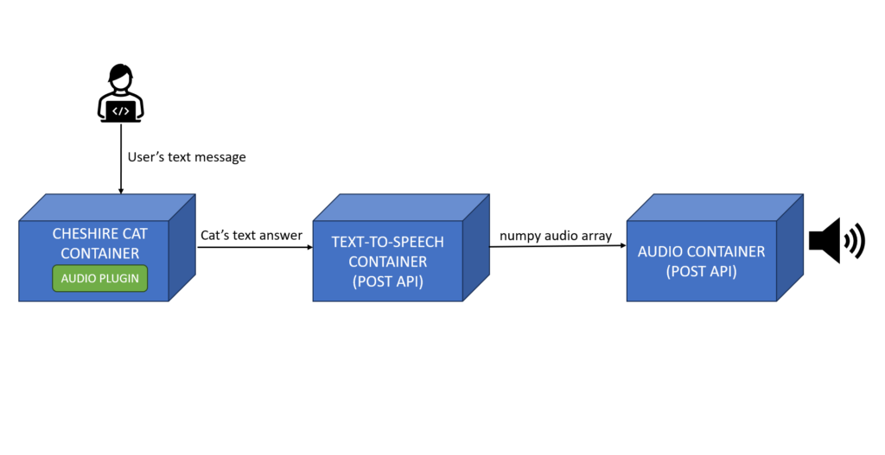
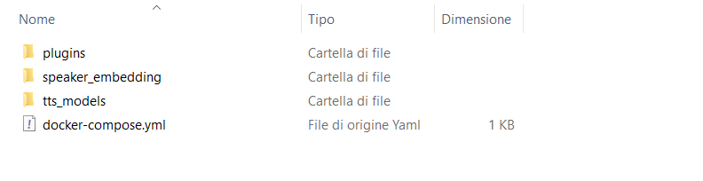

> A multi-container application that allows the Cheshire Cat to talk!

Giving voice to your favorite chatbot can increase the quality of the interaction by introducing a high degree of personalization to it.  
In this tutorial we will see how to build a multi-container application for voicing the Cheshire Cat. Along with the Cat docker image, we will use two custom images for [text-to-speech](https://hub.docker.com/r/alessio21/text-to-speech) conversion and [audio generation](https://hub.docker.com/r/alessio21/play-numpy-array).  
These two images are intended for stand alone use and therefore you can easily integrate them into other projects!

You can find the official repository of this tutorial [here](https://github.com/alessio-git21/voicing-the-cheshire-cat). In any case, here we give you a full description of how the application works and how to run it properly.

## Features

- **Modular design:** The multi-container application is designed with modularity in mind, making it adaptable for use in various chatbot scenarios beyond the Cheshire Cat project.

- **No audio file is stored anywhere:** The audio is generated "on the fly".

- **Multi-speaker:** Different speakers available.

- **SpeechT5 model running inside:** SpeechT5 is a transformer-based architecture capable of performing different audio task. In this project we intend to employ this model for the text-to-speech task.

- **No external API for text-to-speech:** The SpeechT5 model runs locally.

## Requirements

- **Docker:** You can install it from the [official web site](https://docs.docker.com/get-docker/).

- **Pulseaudio:** Pulseaudio is a sound server system for Unix-like operating systems but you can use it also on Windows. We will describe below how to install it for Windows.

#### Pulseaudio for Windows

- download the zip file [here](https://www.freedesktop.org/wiki/Software/PulseAudio/Ports/Windows/Support/), extract and place it in a folder of your choice.

- go to the _etc/pulse/daemon.conf_ file, uncomment and set the "exit-idle-time" parameter equal to -1.

- go to the _etc/pulse/default.pa_ file, search for "load-module module-native-protocol-tcp", uncomment it and on the same line add "listen=0.0.0.0 auth-anonymous=1".

- open Windows PowerShell, move to the previous chosen folder and run: `.\pulseaudio-1.1\bin\pulseaudio.exe --use-pid-file=false -D`

Congratulations! Now you should have Pulseaudio running on your pc. If you'd like, in the [audio generation image overview](https://hub.docker.com/r/alessio21/play-numpy-array) you can find the same procedure just described here along with a simple stand-alone tutorial for generating audio from a generic numpy array.

## How the application works

This simple image illustrates how the application we are building works:

<figure>



<figcaption>

The application workflow. The Cheshire Cat container receives a text message from the user, the LLM generates the answer and the audio plugin sends it to the text-to-speech container via POST API. Here the SpeechT5 model converts the Cat's answer into an audio array and the audio container generates audio from it.

</figcaption>

</figure>

## Let's build!

To get started, create a project folder with the following internal structure:

- a _plugins_ folder

- a _speaker\_embedding_ folder

- a _tts\_models_ folder

- a _docker-compose.yml_ file



#### Plugin

In _plugins_ we create a simple plugin that will send the Cat's anwers in text format to the text-to-speech container. In case you don't know how to write a plugin, we recommend you read this [simple tutorial](https://cheshirecat.ai/write-your-first-plugin/).

Here is the code for the plugin:

```
from cat.mad_hatter.decorators import hook
import requests

API_URL = "http://container_tts:1000/tts"

@hook
def before_cat_sends_message(message, cat):
    #send the cat answer to container_tts for text-to-speech
    payload = {"text":message["content"]}
    resp = requests.post(API_URL, json=payload)
    
    return message

```

#### Speaker embeddings

Download the numpy arrays you want from [here](https://github.com/alessio-git21/voicing-the-cheshire-cat/tree/master/speaker_embedding) and put them in _speaker\_embeddings_. These arrays, known as x-vectors, represent the vocal characteristics of a speaker. The SpeechT5 model uses the x-vectors to generate audio with the corresponding speaker's voice.

#### Text-to-speech models

When you start the application for the first time, you will find the text-to-speech model in _tts\_models_. If you want to understand how the SpeechT5 model works for text-to-speech (and more!), you can read [this](https://huggingface.co/blog/speecht5) article.

#### Docker compose file

Connect all the containers with a _docker-compose.yml_ file. Here is how the file looks like:

```
version: '3'

networks:
  audio_for_cheshirecat:
    driver: bridge

services:

  cheshire-cat-core:
    image: ghcr.io/cheshire-cat-ai/core:latest
    container_name: cheshire_cat_core
    ports:
      - ${CORE_PORT:-1865}:80
    environment:
      - PYTHONUNBUFFERED=1
      - WATCHFILES_FORCE_POLLING=true
    networks:
      - audio_for_cheshirecat
    volumes:
      - ./static:/app/cat/static
      - ./plugins:/app/cat/plugins
      - ./data:/app/cat/data

  container_audio:
    image: alessio21/play-numpy-array
    ports:
     - "2865:2865"
    networks:
      - audio_for_cheshirecat

  container_tts:
    image: alessio21/text-to-speech
    ports:
     - "1000:1000"
    volumes:
     - ./tts_models:/app/models
     - ./speaker_embedding:/app/speaker_embedding
    environment:
      - SPEAKER=slt
      - API_URL=http://container_audio:2865/send_array
    networks:
      - audio_for_cheshirecat
```

Use the SPEAKER environment variable to change the speaker embedding: you can set its value with one of the numpy filenames available in _speaker\_embeddings_.

## How to run

From the command prompt, move to your project folder and run:

```
docker compose up
```

Once all the services have been launched, go to [http://localhost:1865/admin](http://localhost:1865/admin), select your preferred language model and activate the audio plugin.

## Enjoy listening to the Cat!

Your application is working, chat with the Cat and listen to its answers!
