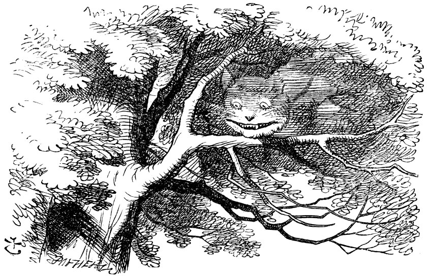

## What is the Cheshire Cat

The Cheshire Cat is an open-source framework that allows you to develop intelligent agents on top of many [Large Language Models](https://cheshire-catai.webflow.io/blog/how-the-cat-works) (LMM). You can develop your custom AI architecture to assist you in a wide range of tasks.

The Cheshire Cat embeds a [long-term memory](https://cheshire-catai.webflow.io/blog/how-the-cat-works) system to save the user's input locally and answer informed by the context of previous conversations. You can also feed text documents in the Cat's memory system to enrich the agent's contextual information and ask it to retrieve them further in the conversation. The Cat currently supports .txt, .pdf and .md files.

If you want the Cat to solve tailored tasks you can extend its capabilities writing Python [plugins](https://cheshire-catai.webflow.io/blog/how-to-write-a-plugin) to execute custom functions or call external services (e.g. APIs and other models).

If you want to build your custom AI architecture, the Cat can help you!

## Currently Supported LLMs

GPT3, ChatGPT, Cohere, HuggingFace Hub, HuggingFace endpoints

