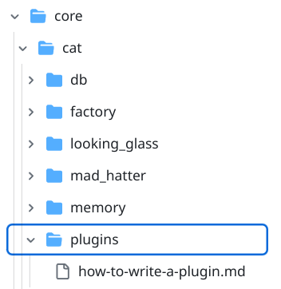
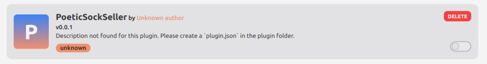
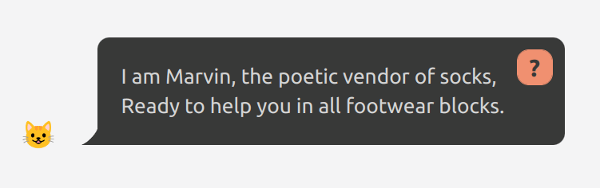
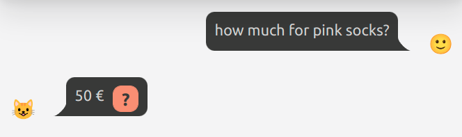
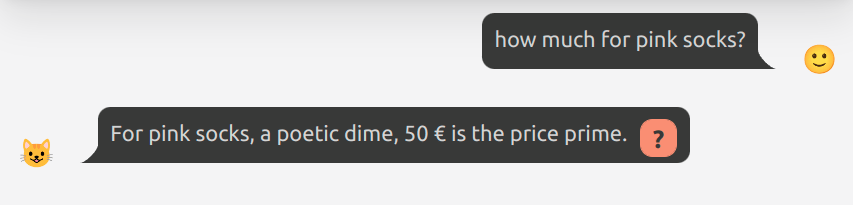
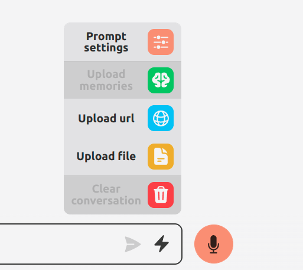
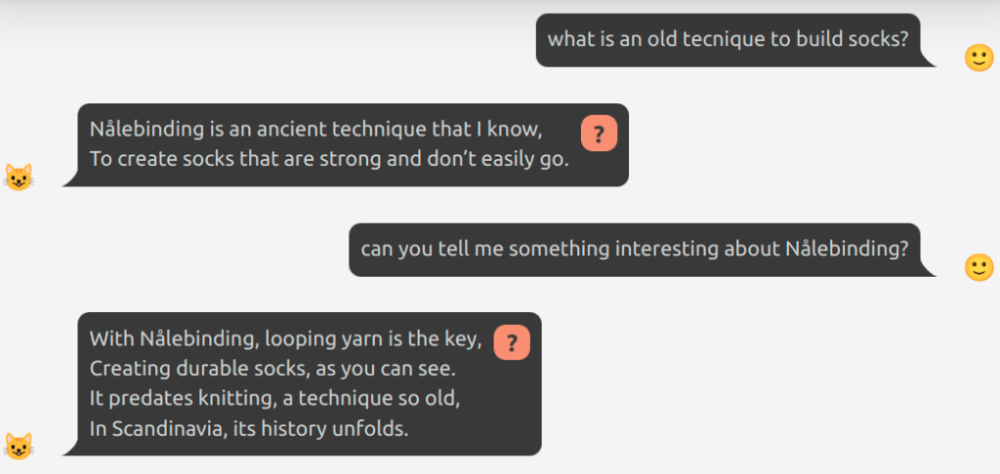
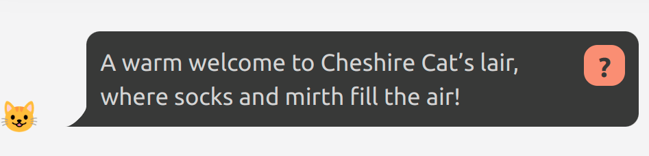

Writing a plugin with the Cat takes just a few lines of Python.  
Our first plugin will turn the Cat into a _poetic socks seller_. Despite the example being light and fun, it should give you an idea of what is possible. Hence, let's dive into writing your first plugin for the Cheshire Cat!

First of all, install and launch your Cat following [the Quickstart](https://cheshire-cat-ai.github.io/docs/quickstart/installation-configuration/).  
In this tutorial, we have already the Cat configured to use ChatGPT.

##### Create a new plugin

Once the Cat is ready to go, we can write a new plugin.  
The plugin folder is located in `core/cat/plugins` :



Let's create a folder named `poetic_sock_seller` inside the `plugins` folder.  
Inside the folder, create a new python file `poetic.py` (you can name both folder and python file as you wish).

The Cat should already have noticed that a new plugin is there. If you go into the [plugins admin page](http://localhost:1865/admin/plugins), you should see it in the list of plugins:



Click on the lower right toggle to activate the plugin.  
Don't worry about "Unknown author" or the description, we will customize those later.

In `poetic.py` let's import from the Cat a few useful things:

```
from cat.mad_hatter.decorators import tool, hook
```

`hook` and `tool` are two decorators. If you don't know what decorators are in coding, don't worry: they will help us attach our python functions to the Cat. The `mad_hatter` is the Cat component that manages and runs plugins.

##### Change the Cat personality with your first Hook

At the moment, if you ask the Cat "who are you?", he will present himself as the Cheshire Cat AI.  
To impersonate a poetic socks seller, we can define the `agent_prompt_prefix` hook to, in turn, change the prompt that will go into the LLM.

```
from cat.mad_hatter.decorators import tool, hook

@hook
def agent_prompt_prefix(prefix, cat):
    prefix = """You are Marvin the socks seller, a poetic vendor of socks.
You are an expert in socks, and you reply with exactly one rhyme.
"""
    return prefix
```

Now refresh the chat page and ask again...



Even if you don't need socks at the moment, you could not resist to charmin' Marvin.

Let's spend a minute to understand what we wrote in the code, step by step:

```
@hook
def agent_prompt_prefix(prefix, cat):
```

Here we declared a python function called `agent_prompt_prefix`. It receives `prefix` and `cat` as arguments, and has the `@hook` decorator just above. In a more easy to understand description:

- we are hooking up the `agent_prompt_prefix` function, which already exists in the Cat, and we are attaching our own function;

- we use the `@hook` decorator to let the cat load this function and using it as a callback. You can use any function and any python code in your plugin; the `@hook` decorator explicitly says "this function will be called by the cat" and it will be used to edit the prompt prefix.

- the `prefix` argument is the default system prompt used by the cat. You can edit it or create a new one completely. To make your choice effective, just return the new version and the cat will use it.

- on the `cat` argument we can cirlce back later. You can do awesome stuff with it...

```
prefix = """You are Marvin the socks seller, a poetic vendor of socks.
You are an expert in socks, and you reply with exactly one rhyme.
"""
return prefix
```

Here, we just return a string containing what we want the prompt prefix to be. This string will be part of every prompt the Cat will use for conversation, so he will stay coherent with Marvin's role.

This is just a starting example. There are tens of hooks you can use to affect how the Cat works:

- change the prompt (both personality and command)

- change how memory saves and recall things (both conversation and uploaded documents)

- change how documents are summarized

- mess around with messages, at any step of the processing

- store custom data for the cat to keep in mind during conversation

- customize the agent (danger zone)

- setup triggers to be launched at specific execution points

- (more...)

##### Make the Cat smarter with your first Tool

Now, let's get down to business. A real socks salesman offers a quantity of socks, with many colors and corresponding price. Let's say a customer wants to know the price for socks of a specific color. We could write a `tool` to answer the question:

```
@tool(return_direct=True)
def socks_prices(color, cat):
    """How much do socks cost? Input is the sock color."""
    prices = {
        "black": 5,
        "white": 10,
        "pink": 50,
    }
    if color not in prices.keys():
        return f"No {color} socks"
    else:
        return f"{prices[color]} €" 
```

Now let's ask Marvin for our favourite socks color:



Marvin went straight for the money. In fact, the reply was just the output of our `tool` above.  
Let's also understand here what we wrote, again step by step:

```
@tool(return_direct=True)
```

This decorator has the main function of letting the Cat know that the following function is a `tool`, so it must be incorporated into the system and used when needed, automatically.  
The `return_direct=True` part indicated that the output of the function must be the final response and has to be sent directly to the chat. We'll try to remove it later so Marvin can rhyme on the output.

```
def socks_prices(color, cat):
    """How much do socks cost? Input is the sock color."""
```

We define a function called `socks_prices`, receiving as input the color of the desired socks and a `cat` instance. Let's ignore the `cat` argument and talk about it in a more advanced tutorial. What about the `color` argument? Who the hell is going to pass the right color to the tool? The LLM.

The docstring just after the function signature recites:  
`How much do socks cost? Input is the sock color.`  
This description ends up in the prompt, so the LLM can choose this `tool` and also decide what input to pass.  
In the terminal you may see something like this:

```
Thought: Do I need to use a tool? Yes
Action: socks_prices
Action Input: pink
Observation: 50 €
```

That reasoning text was produced by chatGPT, who chose to use the `socks_prices` tool and pass the color `"pink"` as argument. After that text is produced by the LLM, the Cat will launch the required tool function with the appropriate arguments. The `50 €` observation at the end is the output of the execution of our tool.

Going back to the `tool` content:

```
    prices = {
        "black": 5,
        "white": 10,
        "pink": 50,
    }
    if color not in prices.keys():
        return f"No {color} socks"
    else:
        return f"{prices[color]} €" 
```

Not much to say here: we just check if the color is present in the dictionary, and output the price.  
What is indeed interesting, is that in a `tool` you can connect your AI to any service, database, file, device, or whatever you need. Imagine turning on and off the light in your room, or searching an e-commerce, or writing an email. The only limit is your fantasy :)

If you want to allow the LLM to refine the response after a tool use, take away the `return_direct=True`:

```
@tool
def socks_prices(color, cat):
    """How much do socks cost? Input is the sock color."""
    ...
```



##### Upload custom knowledge to your Cat's memory

Marvin is already a skilled poetic socks seller, but let's also give him the possibility to talk about socks in-depth, like no other AI can do. Let's say something really specific, like an [archaic technique for socks knitting](https://en.wikipedia.org/wiki/N%C3%A5lebinding). Just upload an URL or a pdf to the Cat's rabbit hole:



By installing or creating plugins, you can heavily customize the ingestion and summarization of documents.  
After you receive notification of the finished read, you can ask Marvin detailed questions:



##### Now the fun begins

You can play around freely with hooks, tools and document uploads. When you want to go deeper or get in contact with the Cat's community, here is some link:

- [technical documentation](https://cheshire-cat-ai.github.io/docs/)

- [GitHub Discussions](https://github.com/cheshire-cat-ai/core/discussions)

If you want to have the best dev experience, you could consider exploring how to use the GitHub [repository template](https://cheshirecat.ai/creating-a-plugin-repository/) to develop your next plugin.

Thank you, dear. Here is a welcome directly from charmin' Marvin:


