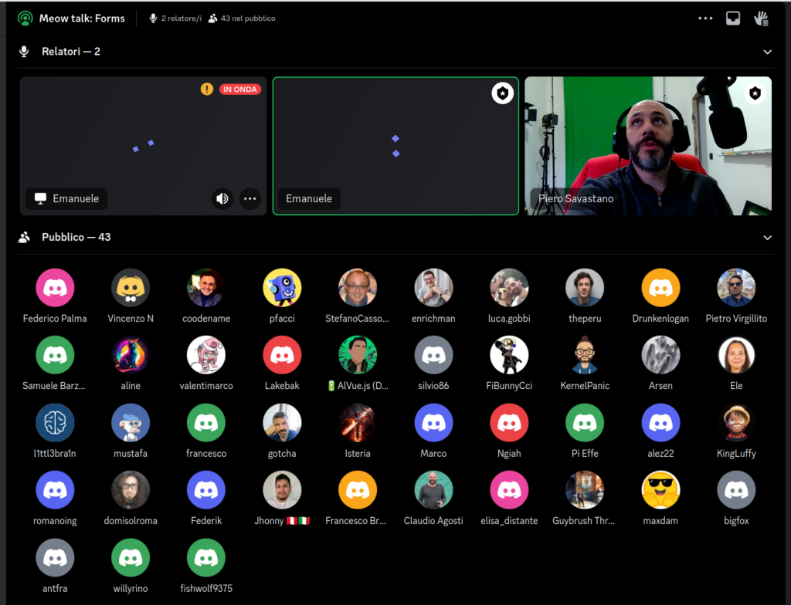
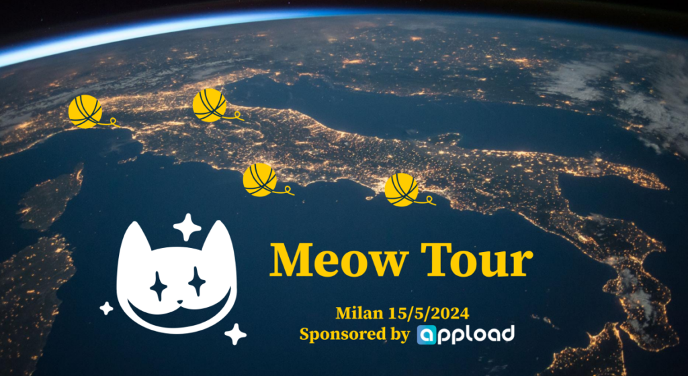

## Cheshire Cat is coming

Join the community, NOW or NEVER!  
In your life you can be a tech pussycat or a cheshire cat, core contibutor, system integrator, event sponsor... decision is now.

## Discord live meetings

We have regular meetings in the [Discord](https://discord.gg/bHX5sNFCYU) to discuss the project state:

- dev meetings every monday at 18:30 to discuss the development of specific features

- community meeting once a month to gather feedback and use cases

- the legendary Meow Talks, during which keynote speakers show their contributions with hands-on practical examples

Start by listening and raise up your paw if you want to say something :)

## In person Meow Tour

We organize regularly [in person events](https://www.meetup.com/it-IT/cheshire-cat-ai-events/). At the moment there is an italian tour with chapters in Rome, Milan, Naples (and more).

During the event there is an install and play session, followed by a speech and networking.

## Wanna sponsor a physical event?

Contact us! See examples of past events [here](https://www.meetup.com/it-IT/cheshire-cat-ai-events/).
