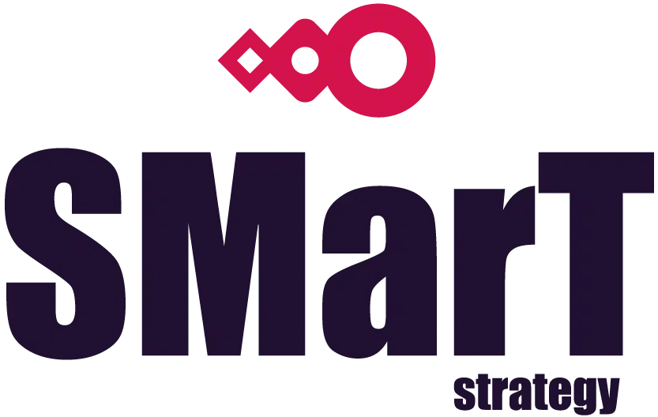
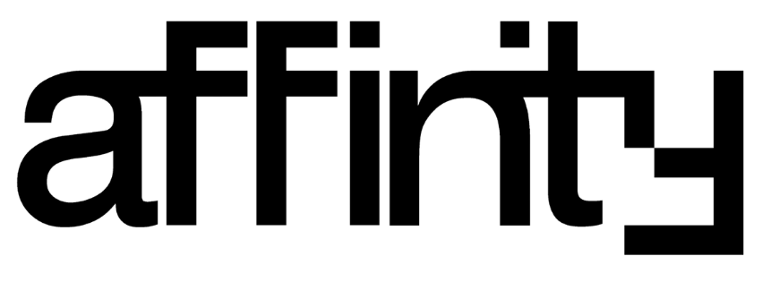

We welcome contributions in code, documentation, tutorials, social media posts, entusiasm and funds!

We are a recognized player in the European open source AI ecosystem, and we put the values of [openness, privacy and creativity](https://cheshirecat.ai/code-of-ethics/) above all.

If you would like to support us, send an [email](mailto:piero@cheshirecat.ai).

##### Meows and purrs for our supporters

A big thank you to companies supporting our open source endeavour:

[Seeweb](https://www.seeweb.it/en) is currently supporting us on development and cloud infrastructure. They are big on private AI and sustainability.

[SmartStrategy](https://smartstrategy.eu/) is supporting the Cheshire Cat with direct code contribution and helping on events organization.

Thanks also to startups and companies who helped us organize events all around Europe:

