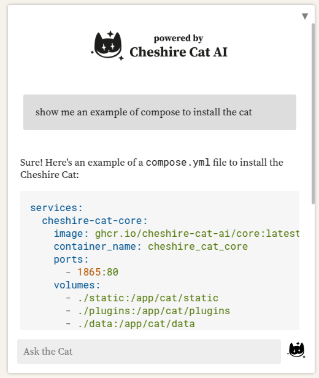
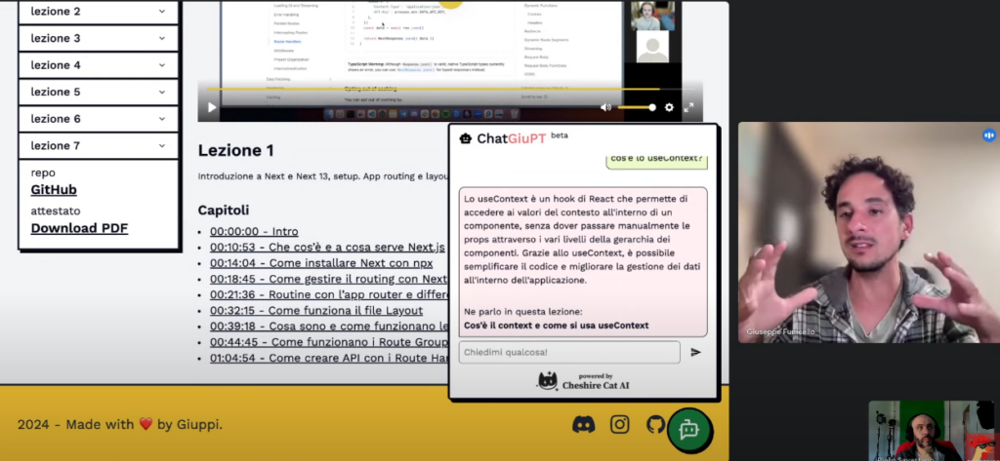
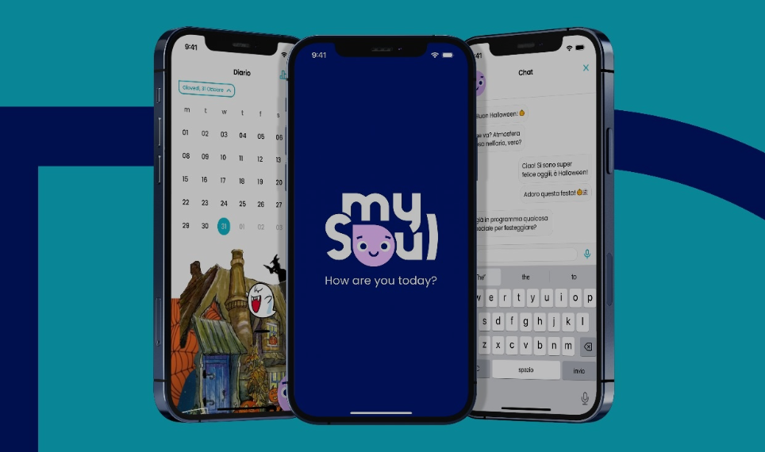
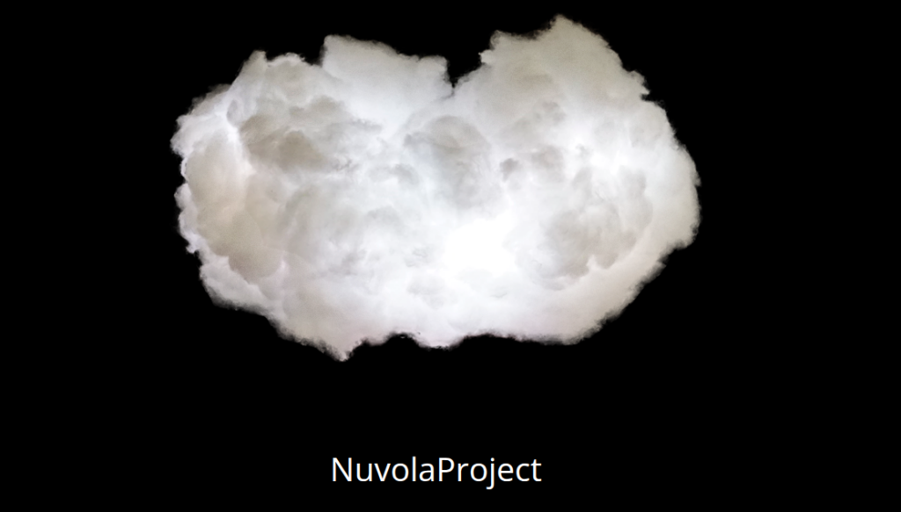

Here you can find some production use cases of the Cat, with links to the authors.  
Contact them to know more or to start a collab. We also have a network of skilled [system integrators](https://cheshirecat.ai/partners/) ready to customize the Cat to your needs.

Keep in mind there are (at least) hundreds of running instances all around the world, and we are proud to power them!

#### DocuCat

In our own technical documentation there is a kind and useful AI willing to help you on how to install the framework, develop plugins and put your masterpiece to production. Surely it is based on the Cat... [have a chat](https://cheshire-cat-ai.github.io/docs/)!

#### ChatGiuPT

[Giuseppe Funicello](https://www.giuppi.dev/) built an AI agent in his educational platform to assist students in retrieving information, giving explicit links to specific moments in his videos where the topic is exaplined. We also interviewed him [here](https://www.youtube.com/watch?v=daVvbRVeBG4&ab_channel=PieroSavastano).

#### MySoul

Startup [Affinity](https://www.affinitylab.it/) leveraged the Cat's conversational flexibility to build MySoul, an AI assistant focused on empathy and personal proactive interactions. We organized together a meetup in the beautiful city of Naples.

#### Mimìr

SmartStrategy contributed as a company to the development of a few Cat's internals. They developed [Mimìr](https://mimir.bot/) using the framework and it is actually serving clients in production with many useful features, like integrations with emails and documents.

#### Nuvola Project

Performance Art duo [Nuvola Project](https://www.nuvolaproject.cloud/) utilized the Cat as an AI addition to many of their internationally recognized installations.

